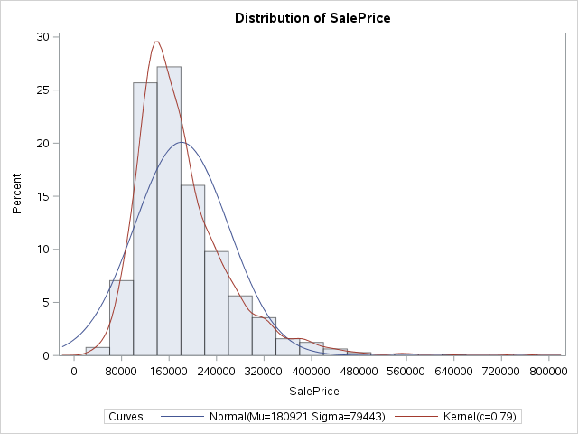
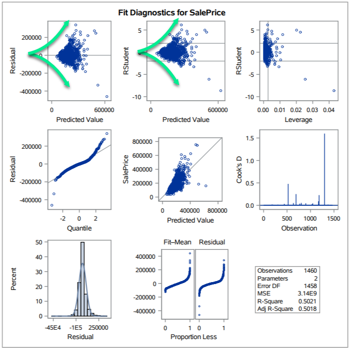

 <!-- <link rel="stylesheet" type="text/css" href="file:://C:\Repositories\Statistics-Team-Fat-Tails\css\bootstrap.min.css"> -->


**[Downloading from the Kaggle API](C:\Repositories\Statistics-Team-Fat-Tails\kaggle-download.md)**

**[Using Code Blocks in Markdown](https://github.com/shd101wyy/markdown-preview-enhanced/blob/master/docs/code-chunk.md)**

**[Using SAS in Markdown Code Blocks](C:\Repositories\Statistics-Team-Fat-Tails\sasmd.Rmd)**


Find more markdown snippits


# Introduction

```r {cmd = true}
  #setup, echo=FALSE, results="hide"}
  # read setup script
  source("Setup.R")
  print("hello world!!!")
```

```python {cmd = true}
print("Verbose will be printed first")
```

--------------------------------------------------------------------------------------------------------------

Ask a home buyer to describe their dream house, and they probably won't begin with the height of the basement ceiling or the proximity to an east-west railroad.   However, it is essential to review the data because it proves that there are many other influences in price negotiations than the number of bedrooms or a white-picket fence.


--------------------------------------------------------------------------------------------------------------

# Data Synopsis

The Ames House dataset was compiled by Dean De Cock and contains 79 explanatory variables describing almost every aspect of residual home in Ames Iowa from 2006 to 2010. The data set contains 2930 observations involved in assessing home values.

--------------------------------------------------------------------------------------------------------------

# Analysis Question 1


<!-- 
1)	ANALYSIS 1: Assume that Century 21 Ames (a real estate company) in Ames, Iowa has commissioned you to answer a very important question with respect to their business.  Century 21 Ames only sells houses in the NAmes, Edwards and BrkSide neighborhoods and would like to simply get an estimate of how the SalePrice of the house is related to the square footage of the living area of the house (GrLIvArea) and if the SalesPrice (and its relationship to square footage) depends on which neighborhood the house is located in. Build and fit a model that will answer this question, keeping in mind that realtors prefer to talk about living area in increments of 100 sq. ft. Provide your client with the estimate (or estimates if it varies by neighborhood) as well as confidence intervals for any estimate(s) you provide. It turns out that Century 21’s leadership team has a member that has some statistical background. Therefore, make sure and provide evidence that the model assumptions are met and that any suspicious observations (outliers / influential observations) have been identified and addressed. Finally, of course, provide your client with a well written conclusion that quantifies the relationship between living area and sale price with respect to these three neighborhoods. Remember that the company is only concerned with the three neighborhoods they sell in.  

Neighborhoods:
field_name : full_name
NAmes =	North Ames
Edwards =	Edwards
BrkSide =	Brookside
-->

## Restatement of Problem

<!-- 
a.	EstimateL SalePrice relation to Square Footage. Are they related? Does the strength of relationship vary by neighborhood??
  i.	Address assumptions
  ii.	Provide an estimate and confidence interval
  iii.	Address suspicious observations
  iv.	Conclusion reported in increments of 100 sq.ft.
-->

To build and fit a model, an analysis must be performed to identify features of the dataset that are statistically significant in their relation to, and prediction of, the sales price.

## Build and Fit the Model

### Interrogate the Data

To build and fit a model, an analysis must be performed to identify features of the dataset that are statistically significant in their relation to, and prediction of, the sales price.


- Plot the data.
- Develop a tentative model(s).
    - Using the question(s) of interest (QOI).
    - Accounting for confounders.
    - Accounting for relationships ($X^2$,$X^3$, $etc$).
- Fit the model(s).
- Evaluate residual plots.
    - Constant SD.
    - Normality and zero me an.
    - Identify any influential observations.


#### Assumptions



##### Homogeneity of Variances



<!-- C:\Repositories\Statistics-Team-Fat-Tails\Figs\train_original_histogram.png -->

<!-- TODO: Finish porting aquations -->

<!-- TODO: Make Plots! -->

Code (will move to appendix later):

```sashtml  {cmd="C:/Program Files/SASHome/SASFoundation/9.4/sas.exe"}
proc import datafile="/home/bfriedrich0/sasuser.v94/train.csv"
     out=train_original
     dbms=csv
     replace;
     getnames=yes;
run;

proc univariate data=train_original noprint;
var SalePrice;
histogram / nrows = 5 kernel normal(noprint);
run;

```


Neighborhooods:
$x_1 = BrkSide$
$x_2 = NAmes$
$x_3 = Edwards$

•	Ames^SalesPrice = B0 + B1*BrkSide + B2*Edwards + B3*NAmes + B4(LogLivingArea*BrkSide) + B5(LogLivingArea*Edwards)

$\hat\mu \{ {SalesPrice} \} \, = \, \beta_0\, +\, \beta_1 \, x \, BrkSide\, +\, \beta_2\,Edwards\, +\, \beta_3\, *\, NAmes\, +\, \beta_4(LivingArea_{log}\, x\, BrkSide) + \beta_{5}\, x\, (LivingArea_{log} \, x\, Edwards)$


$\mu\{\widehat{SalesPrice_{Ames}}\} \, = \, \beta_0\, +\, \beta_1 \, x \, BrkSide\, +\, \beta_2\,Edwards\, +\, \beta_3\, *\, NAmes\, +\, \beta_4(LivingArea_{log}\, x\, BrkSide) + \beta_{5}\, x\, (LivingArea_{log} \, x\, Edwards)$


% •	Ames^SalesPrice = 8.49 + (-2.58*BrkSide) + (-0.49*Edwards)  + (0.0 * NAmes) + (B3*0.0) + B4(0.47*BrkSide) + B5(0.47*Edwards)

<!--
Potential Objectives:
-  ~~Adjusting for a large set of explanatory variables.~~ - NO
-  ~~Fishing for an explanation.~~ - NO
-  Prediction - YES
-->

<!--
Are we attempting to predict the mean or a single value?
-  Mean - YES
-  ~~Specific Value~~ - NO
-->


--------------------------------------------------------------------------------------------------------------

# Analysis Question 2

<!-- 
2)	ANALYSIS 2: Build the most predictive model for sales prices of homes in all of Ames Iowa.  This includes all neighborhoods. Your group is limited to only the techniques we have learned in 6371 (no random forests or other methods we have not yet covered).  Specifically, you should produce 4 models: one from forward selection, one from backwards elimination, one from stepwise selection, and one that you build custom.  The custom model could be one of the three preceding models or one that you build by adding or subtracting variables at your will.  Generate an adjusted R2, CV Press and Kaggle Score for each of these models and clearly describe which model you feel is the best in terms of being able to predict future sale prices of homes in Ames, Iowa.  In your paper, please include a table similar to the one below.  The group with the lowest public Kaggle score will receive an extra 3 bonus points on the final exam!   -->
<!-- Quick note on Kaggle completion:  We only have one course under our belts so far (almost), but you can compete in this competition with the tools you have now (top 40th percentile or better!). After your next course (6372), you will really be able to do well (top 25th percentile or better!). With these skills as well as the skills you pick up in Data Mining and Quantifying the World, you will be able to compete with anyone!	 
-->

