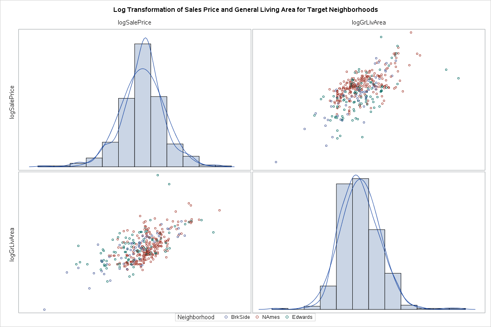
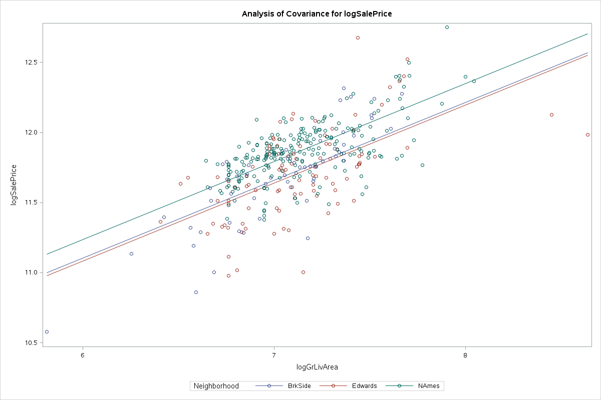
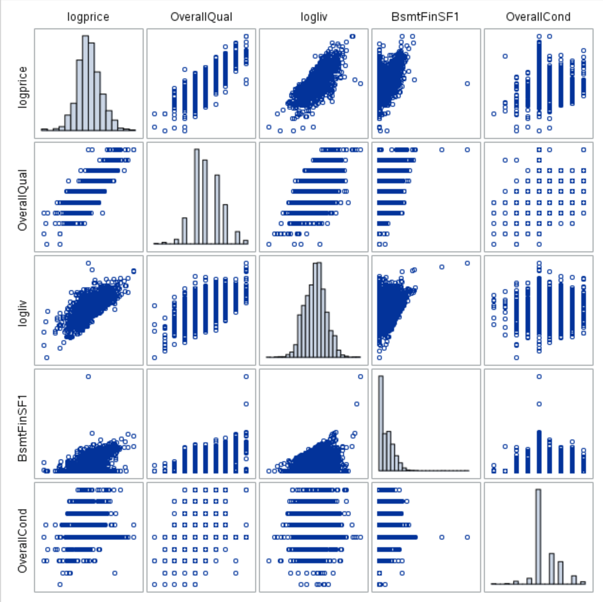

# Ameing for the Stars: Predicting Home Value in Ames, Iowa

**A Kaggle Project by Team Fat Tails**

---

Authors: Quinton Nixon, Grant Bourzikas, Brock Friedrich
Date: Aug. 12, 2018

* [Introduction](#introduction)
* [Data Synopsis](#data-synopsis)
* [Analysis Question 1](#analysis-question-1)
	* [Restatement of Problem](#restatement-of-problem)
	* [Build and Fit the Model](#build-and-fit-the-model)
	* [Model Comparison](#model-comparison)
	* [Conclusion](#conclusion)
* [Analysis Question 2](#analysis-question-2)
	* [Restate Problem](#restate-problem)
	* [Model Selection](#model-selection)
	* [Check Assumptions](#check-assumptions)
	* [Comparing Competing Models](#comparing-competing-models)
	* [Conclusion](#conclusion-1)
* [Appendix](#appendix-a)

<!-- TODO: Add QUinton's additional snippets -->

---

## Introduction

Ask a home buyer to describe their dream house, and they probably won't begin with the height of the basement ceiling or the proximity to an east-west railroad.   However, it is essential to review the data because it proves that there are many other influences in price negotiations than the number of bedrooms or a white-picket fence.

---

## Data Synopsis

<!-- 
Where did the data come from?  How big is it? 

How many observations?  Where can we find out more?  

What are the specific variables that we need to know with respect to your analysis?

 -->

The Ames House dataset was compiled by Dean De Cock and contains 79 explanatory variables describing almost every aspect of residual home in Ames Iowa from 2006 to 2010. The data set contains 2930 observations involved in assessing home values.

Data summary for North Ames, Edwards, and Brookside neighborhoods: 

| Variable     | N   | N Miss | Minimum | Maximum | Mean   | Median | Quartile Range |
|--------------|-----|--------|---------|---------|--------|--------|----------------|
| Id           | 383 | 0      | 10      | 1460    | 744    | 729    | 744            |
| MSSubClass   | 383 | 0      | 20      | 190     | 45     | 30     | 40             |
| GrLivArea    | 383 | 0      | 334     | 5642    | 1302   | 1200   | 503            |
| SalePrice    | 383 | 0      | 39300   | 345000  | 138063 | 135500 | 39000          |
| logSalePrice | 383 | 0      | 11      | 13      | 12     | 12     | 0              |
| logGrLivArea | 383 | 0      | 6       | 9       | 7      | 7      | 0              |

No Transformation            |  Log Transformation
:-------------------------:|:-------------------------:
  |  

<!-- TODO: Add plot interpretation -->

* [More data definitions](#appendix-b)

---

## Analysis Question 1

<!--
1)	ANALYSIS 1: Assume that Century 21 Ames (a real estate company) in Ames, Iowa has commissioned you to answer a very important question with respect to their business.  Century 21 Ames only sells houses in the NAmes, Edwards and BrkSide neighborhoods and would like to simply get an estimate of how the SalePrice of the house is related to the square footage of the living area of the house (GrLIvArea) and if the SalesPrice (and its relationship to square footage) depends on which neighborhood the house is located in. Build and fit a model that will answer this question, keeping in mind that realtors prefer to talk about living area in increments of 100 sq. ft. Provide your client with the estimate (or estimates if it varies by neighborhood) as well as confidence intervals for any estimate(s) you provide. It turns out that Century 21’s leadership team has a member that has some statistical background. Therefore, make sure and provide evidence that the model assumptions are met and that any suspicious observations (outliers / influential observations) have been identified and addressed. Finally, of course, provide your client with a well written conclusion that quantifies the relationship between living area and sale price with respect to these three neighborhoods. Remember that the company is only concerned with the three neighborhoods they sell in.  

Variables:
---------------
Neighborhood: Physical locations within Ames city limits
GrLivArea: Above grade (ground) living area square feet

Neighborhoods:
---------------
field_name : full_name
NAmes =	North Ames
Edwards =	Edwards
BrkSide =	Brookside

-->

<!-- * Plot the data.
* Develop a tentative model(s).
    * Using the question(s) of interest (QOI).
    * Accounting for confounders.
    * Accounting for relationships ($X^2$,$X^3$, $etc$).
* Fit the model(s).
* Evaluate residual plots.
    * Constant SD.
    * Normality and zero me an.
    * Identify any influential observations. -->

### Restatement of Problem

<!-- 
a.	EstimateL SalePrice relation to Square Footage. Are they related? Does the strength of relationship vary by neighborhood??
  i.	Address assumptions
  ii.	Provide an estimate and confidence interval
  iii.	Address suspicious observations
  iv.	Conclusion reported in increments of 100 sq.ft.
-->

Century 21 has commissioned Nixon, Friedrich, and Bourzikas to perform a study to derive insights regarding homes prices in Ames.  Century focuses on three neighborhoods in Ames: “North Ames”, “Edwards”, and “Brookside”. They would like to get an estimate of how the Sales Price of the house is related to the square footage of the living area of the house.  Additionally, they would like to understand the relationship between sales price and the living area square footage, as well as investigating any relationship between sales price and that home’s neighborhood.

### Build and Fit the Model

In order to build and fit a model, an analysis must be performed to identify features of the dataset that are statistically significant in their relation to, and prediction of, the sales price.

When one of the predictor variables impacts how another predictor variable is related to the dependent variable.  A multiple linear regression model in which the mean of the LogLivingArea depends linearly on the important of the LogSalesPrice and all three Neighborhoods, allowing for different slopes and intercepts, is as follow:

In Assessing the Fit, the coefficient is interpreted by the following models utilizing the base formula:
•	Ames^SalesPrice = β0 + β1*BrkSide + β1*Edwards + β3:*NAmes + β4 (LogLivingArea*BrkSide) + β5(LogLivingArea*Edwards)
o	β0: The intercept in this model provides an estimate 8.49 of the logGrLivArwea (reference NAmes) with a logGrLivArwea of zero. Of course, this is extrapolation and does not have a clear, practical meaning.
o	β1: This is the adjustment of the intercept for a Neighborhood BrkSide with respect to a NAmes Neighborhood. For a Living room of zero, the Neighborhood BrkSide has an estimated Sale Price Increases of -5. 16 (2^-2.58 back transformation) dollars per square foot less than the NAmes Livingroom. 
o	β1 This is the adjustment of the intercept for a Neighborhood Edwards with respect to a NAmes Neighborhood. For a Living room of zero, the Neighborhood Edwards has an estimated Sale Price Increases of -1.40 (2^-0.49 back transformation) dollars per square foot less than the NAmes Livingroom.
o	β3: For each 1 unit increase in the Living Room of a NAmes, the estimated Sale Price increases 2^0.47 units
o	β4: For each 1 unit increase in the Living Room Size of BrkSide, the estimated Sale Price increases 8.16 (2^0.35 Back transformed) dollars per square foot from the change with the NAmes.
o	β5: For each 1 unit increase in the Living Room Size of Edwards, the estimated Sale Price increases 1.04 (2^0.05 Back transformed) dollars per square foot from the change with the NAmes.

<!-- TODO: Regression Fit -->

---

#### Assumptions

In reviewing the data, an analysis was performed using QQ Plots and Histograms, the linearity of the data is not in question due to the sample size, the data is right skewed and is not normally distributed as depicted, the data does not have equal standard deviations, and the data is independent of each other.

Because the assumptions in the data do not support evidence that will allow the study to continue due to data, transformation of the data was perfromed using the Log of the Sales Price and Log of the Grang Living Area.  Upon this transforamtion, the linearity of the data is not in question, that is not strong evidence against normalizty of residuals looking at the histogram and QQ plot, the standard deviasion appear to be equel, and the data is indpependent.   Addtionaly, there is a constant variance after the trasnformation occurred.

Additionaly, the it is assumped that the data is independent due to each house being unique to each neighnborhood. 

After the transformation, the data was interrogated and a review of the studentized residuals and Cooks D was performed by running a fit diagnostic through our Proc Reg code.    The review of Studentized residual identified one outliers that was related to a very large grand living room square footage and two outliers were related homes that have Sales price over 700,000 representing less than 0.13%.   While these data points are low leverage with big residuals, Cooks D only show a mile problem.  Due to the sample size, the Homes remained in the data set because these do not appear to affect the data.

##### Collinearity

Additionally, there is no collinearity in the data because Neighborhood and Grand Living are correlated with the Sales Price, if using differently each neighborhood variable as independent data.  Since these variables are correlated with each other and the response variables, it is not difficult to parse out how each will impact the response variable independently.

##### R2

With only an $R^2$ .421 and an adjusted $R^2$ of .418, the fit of of the model of predicting sales price by Nieghborhood and Grand Living Room square foot, is not a good model.  It is recommended that additianla variables should be used to calculate a more accute Sales Price.

---

#### Model Comparison

After reviewing the models after and before the transformation, the R-Squared is (0.51, 0.45, respectively) with a RMSE of (0.19, 28552.30, respectively)  and a Coefficient Variance of (1.63, 20.68, respectively) ensuring the better fit is with the transformed data.

##### No Interactions

<!-- TODO: Equation -->

| Number of Observations Used | 383 |
|-----------------------------|-----|

| R-Square | Coeff Var | Root MSE | logSalePrice Mean |
|----------|-----------|----------|-------------------|
| 0.489705 | 1.66218   | 0.196118 | 11.79887          |

| Parameter 	| Estimate 	| Standard Error 	| t Value 	| Pr > t 	| LCL 	| UCL 	|
|----------------------	|--------------	|----------------	|---------	|--------	|--------------	|--------------	|
| Intercept 	| 7.90214954 	| 0.23133976 	| 34.16 	| <.0001 	| 7.447279361 	| 8.357019719 	|
| logGrLivArea 	| 0.555788385 	| 0.03236859 	| 17.17 	| <.0001 	| 0.492143867 	| 0.619432902 	|
| Neighborhood BrkSide 	| -0.132788629 	| 0.02906111 	| -4.57 	| <.0001 	| -0.189929827 	| -0.075647431 	|
| Neighborhood Edwards 	| -0.153226231 	| 0.02357095 	| -6.5 	| <.0001 	| -0.199572446 	| -0.106880015 	|
| Neighborhood NAmes 	| 0 	| . 	| . 	| . 	| . 	| . 	|

##### With Interactions

| Number of Observations Used | 383 |
|-----------------------------|-----|

| R-Square 	| Coeff Var 	| Root MSE 	| logSalePrice Mean 	|
|----------	|-----------	|----------	|-------------------	|
| 0.512092 	| 1.629617 	| 0.192276 	| 11.79887 	|

| Parameter 	| Estimate 	| Standard Error 	| t Value 	| Pr > t 	| LCL 	| UCL 	|
|------------------------------	|--------------	|----------------	|---------	|--------	|--------------	|--------------	|
| Intercept 	| 8.492727641 	| 0.32441709 	| 26.18 	| <.0001 	| 7.854833978 	| 9.130621305 	|
| logGrLivArea 	| 0.473023602 	| 0.04542895 	| 10.41 	| <.0001 	| 0.383697733 	| 0.562349471 	|
| Neighborhood BrkSide 	| -2.579806905 	| 0.59988132 	| -4.3 	| <.0001 	| -3.759339383 	| -1.400274428 	|
| Neighborhood Edwards 	| -0.486220461 	| 0.51750833 	| -0.94 	| 0.3481 	| -1.503784863 	| 0.531343941 	|
| Neighborhood NAmes 	| 0 	| . 	| . 	| . 	| . 	| . 	|
| logGrLivA*Neighborho BrkSide 	| 0.346624454 	| 0.08482008 	| 4.09 	| <.0001 	| 0.179844737 	| 0.513404171 	|
| logGrLivA*Neighborho Edwards 	| 0.046643642 	| 0.07248011 	| 0.64 	| 0.5203 	| -0.09587228 	| 0.189159563 	|
| logGrLivA*Neighborho NAmes 	| 0 	| . 	| . 	| . 	| . 	| . 	|

##### Parameters & Equations

<!-- 
	  - Estimates
      - Interpretation 
      - Confidence Intervals 

Variables:
SalesPrice = SP
LivingArea = LA -->

<!-- $\hat\mu \{ {SP_{log}} \} \, = \, \beta_0\, +\, \beta_1 \, \, BrkSide\, +\, \beta_2\,Edwards\, +\, \beta_3\, \, Ames\, +\, \beta_4(LivingArea_{log}\, \, BrkSide) + \beta_{5}\, x\, (LivingArea_{log} \, \, Edwards)$ -->

---

**General Formula:** $\,\,
\hat\mu \{ {log(SP)} \}
\,=\,
\beta_0\,
+\,\beta_1\,Brookside\,
+\,\beta_2\,Edwards\,
+\,\beta_3\,Ames\,
+\,\beta_4(log(LA)\,Brookside)
+\beta_{5}\,(log(LA)\,Edwards)
$

<!-- TODO: Reference appendix -->
---

<!-- TODO: Add regression equations for NAmes neighborhood -->

<!-- $$\hat\mu \{ {log(SP_{Ames})} \} \, = \, \beta_0\, +\, \beta_1 \, \, BrkSide\, +\, \beta_2\,Edwards\, +\, \beta_3\, \, NAmes\, +\, \beta_4(LivingArea_{log}\, \, BrkSide) + \beta_{5}\, x\, (LivingArea_{log} \, \, Edwards)$$ -->

<!-- TODO: Add regression equations for Brkside neighborhood -->
<!-- 
$$
\hat\mu \{ {log(SP_{BrkSide})} \}
\,=\,
\beta_0\,
+\,\beta_1\,Brookside\,
+\,\beta_2\,Edwards\,
+\,\beta_3\,Ames\,
+\,\beta_4(log(LA)\,Brookside)
+\beta_{5}\,(log(LA)\,Edwards)
$$ -->

<!-- TODO: Add regression equations for Edwards neighborhood -->

<!-- $$\hat\mu \{ {log(SP_{Edwards})} \} \, = \, \beta_0\, +\, \beta_1 \, \, BrkSide\, +\, \beta_2\,Edwards\, +\, \beta_3\, \, NAmes\, +\, \beta_4(LivingArea_{log}\, \, BrkSide) + \beta_{5}\, x\, (LivingArea_{log} \, \, Edwards)$$ -->

#### Conclusion

<!--
Potential Objectives:
-  ~~Adjusting for a large set of explanatory variables.~~ - NO
-  ~~Fishing for an explanation.~~ - NO
-  Prediction - YES
-->

<!--
Are we attempting to predict the mean or a single value?
-  Mean - YES
-  ~~Specific Value~~ - NO
-->
To interpret the model, a change in Living Room Square Feet Is a 2x increase.  For the neighborhood with approximately the same mass, it is estimate that a 2-fold increase in the Living Area Square feet is associated with a ($e^{0.47} = 1.39$) which is a 38.8% increase in the median Sales Price of the neighborhood. (P value < 0.001).  At a 95% confidence intervals for the increase in sales price of (e^{0.38}, e^{0.56}) = (1.3, 1.48) which equates to an estimated increase between **30.5%** and **47.7%**.

 Doubling the living area space multiplies the predicted median sales price of North Ames homes by $e^{0.47} = 1.39$. In other words, the sales price increases by **38%** for every doubling of square footage in the general living space.

| LivingArea 	|  	|  	|  	|
|------------	|-------	|-------	|-------	|
| estimate 	| 0.47 	| 0.38 	| 0.56 	|
| change 	| 1.39 	| 1.30 	| 1.48 	|
| % change 	| 38.80 	| 30.47 	| 47.67 	|
<!-- 
 To interpret the model, a change in Living Room Square Feet is a doubled increase.  For the neighborhood with approximately the same mass, it is estimate that a 10-fold increase in the Living Area Square feet is associated with a XX which is a 83.2% increase in the median Sales Price of the neighborhood. (P value < 0.001).  At a 95% confidence intervals for the increase in sales price of XX = CI which equates to an estimated increase between X% and X%. -->

<!-- TODO: Add verbage -->

<!-- TODO: Add regression plots -->

---

## Analysis Question 2

<!-- 
2)	ANALYSIS 2: Build the most predictive model for sales prices of homes in all of Ames Iowa.  This includes all neighborhoods. Your group is limited to only the techniques we have learned in 6371 (no random forests or other methods we have not yet covered).  Specifically, you should produce 4 models: one from forward selection, one from backwards elimination, one from stepwise selection, and one that you build custom.  The custom model could be one of the three preceding models or one that you build by adding or subtracting variables at your will.  Generate an adjusted R2, CV Press and Kaggle Score for each of these models and clearly describe which model you feel is the best in terms of being able to predict future sale prices of homes in Ames, Iowa.  In your paper, please include a table similar to the one below.  The group with the lowest public Kaggle score will receive an extra 3 bonus points on the final exam!   -->
<!-- Quick note on Kaggle completion:  We only have one course under our belts so far (almost), but you can compete in this competition with the tools you have now (top 40th percentile or better!). After your next course (6372), you will really be able to do well (top 25th percentile or better!). With these skills as well as the skills you pick up in Data Mining and Quantifying the World, you will be able to compete with anyone!	 

| Predictive Models | Adjusted R2 | CV PRESS | Kaggle Score |
|-------------------|-------------|----------|--------------|
| Forward           | .89         | 1272     | .721         |
| Backward          | .78         | 1590     | .945         |
| Stepwise          | .81         | 2001     | .888         |
| CUSTOM            | .87         | 900      | .2345        |
-->

<!-- 
NOTE 1: 
ALL ANALYSES MUST BE DONE IN SAS and all code must be placed in the appendix.  Part of the grading process will be to run the code and verify the Kaggle score for each group.

Note 2: 
An extra 3 points on the final exam will be awarded to the team with the model with the lowest (best) Kaggle Score.  In the unlikely event of a tie will split these points.  

Deliverables:
Your group is to turn in a paper should be no more than 7 pages long (without the appendix). Please put your code in the appendix. If you are concerned with staying within the allotted 7 pages, put more screenshots and such in the appendix.
 -->

### Restate Problem

Our objective is to build the most predictive model for sale prices of homes in Ames, Iowa using only the tools learned through week 14 of MSDS 6371.  We are to produce and compare four models:  forward selection, backward elimination, stepwise selection, and a custom model.  Models are to be evaluated on adjusted R^2, CV PRESS, and Kaggle score.  We want the model that does the best job predicting future prices (that is, best Kaggle score wins).

### Model Selection

<!-- Data: All Neighborhoods
     

Forward - Starts empty, incrementally adds variables
Backward - Starts full, incrementally removes variables.
Stepwise - ???, More random. Can add or remove until it finds the best score.
Custom -  ???

 -->

Backward elimination, forward selection, stepwise selection, and custom models were built for this question.  All models were built using log-log transformed data (log of SalePrice and log of GrLivArea).  Forward selection and stepwise selection had comparable Kaggle scores.  Based on interpretability, the Forward Selection Model was chosen.

### Check Assumptions

<!-- The model must have: 1) Linearity, 2) Residuals are normally distributed, 3) Independence, 4) Errors should have mean of 0 and have the same variance, 5) Equal SD: There is little evidence from the scatter plots of heteroscedasticity, 6) Normality of scatter plot, qq plot, and histogram of residuals -->
Based on the lack of overwhelming evidence to support the assumptions, a number of transformations were considered and a decision was made to use a log-log transformation as the basis of the most predictive model.

* **Linearity**
	We know from the previous question that SalePrice is linearly correlated with some of the explanatory variables (size, for example), but it is unlikely to be correlated with all of them.  

* **Heteroscedacity**
	There is some visual evidence against constant variance.  With the large number of observations, visual inspection becomes more challenging.

* **Normality**
	A histogram of saleprice across all neighborhoods shows evidence of right skewness.

* **Independence**
	Although, homeowners are free to price their homes as they wish and buyers can make whatever offer they choose, there is no way to say with much certainty that home prices are truly independent.

* **Residual Diagnostics**

<!-- TODO: Add plots -->

<!-- TODO: Add interpretation and plots -->

* **Outlier Analysis**

<!-- The rstudent values have the majority of the data within range of the limits, with the center value as 0 (4). There are some data points still causing leverage in the data. The cook’s D has some data points that would influence the linear regression of the data, but when doing further exploration, those data points are not caused by the 3 neighborhoods that we are trying to analyze. -->

Two observations had CooksD values significantly higher than other observations.

<!-- TODO: Insert Reg Plots -->

And no observations appeared to be particularly high leverage so we can proceed without the need to removing any observations prior to modelling.  

### Comparing Competing Models

| Predictive Models 	| Adjusted R2 	| CV PRESS 	| Kaggle Score 	|
|-------------------	|-------------	|----------	|--------------	|
| Forward 	| .8501 	| 31.18449 		| .14880 			|
| Backward 	| .9350 	| 31.67571 		| .21225 		|
| Stepwise 	| .9206 	| 19.14915 		| .14880 		|
| CUSTOM 	| .9351 	| 31.84610 		| .21261 		|

**Best model:  Forward selection**

The “best” model in this situation is one that has a high degree of predictable power and is easy to interpret.  That model is the forward selection model.

At five explanatory variables, the forward selection model is relatively small.  It includes coefficients for OverallCond, OverallQual, BsmtFinSF1, Neighborhood and logliv.  In other words, it predicts that the price of a home is a function of its location, size, and overall condition.

Each neighborhood has a coefficient that acts as a multiplier for a % increase or decrease in the mean SalePrice relative to the Veenker Neighborhood (reference level selected by SAS).

The equation for this model is the following:

<!-- Log(SalePrice) = Beta0 + Beta1*OverallQual + Beta2*OverallCond + Beta3*BsmtFinSF1 + Beta4*log(GrLivArea) + Beta5*Neighborhood -->

$$
\hat\mu \{ {log(SalePrice)} \}
\,=\,
\beta_0\,
+\,\beta_1\,OverallQual\,
+\,\beta_2\,OverallCond\,
+\,\beta_3\,BsmtFinSF1\,
+\,\beta_4\,log(GrLivArea)
+\beta_{5}\,Neighborhood
$$

### Conclusion

What this means in real world terms is that a 10% increase in the above ground living area should result in an ~4.4% increase in price ($1.1^{\beta_4} = 1.1^{0.455} = 1.044$) due to log transforming the SalePrice and the GrLivArea variable.

The selection of Neighborhood impacts the mean selling price by the relative percentage of $e^{\beta_5}$.  The mean price for Neighborhoods with negative coefficients goes down relative to the Veenker reference neighborhood.

For each unit increase in the OverallQual score, the mean selling price will increase by approx. 10% ($e^{\beta_1} = e^{0.0956} = 1.10$).

For each unit increase in OverallCond score, the mean selling price will increase by approx. 4.9% ($e^{\beta_2} = e^{0.0477} = 1.0488$).

For each unit increase in BsmtFinSF1, the mean selling price will increase by approx. 0.0012% ($e^{\beta_3} = e^{0.000118} = 1.000118007$).

Visually we can see that $\log$(GrLivArea) is the strongest predictor of price followed by OverallQual.  This makes sense conceptually.  It’s reasonable to assume people will pay more for a big, nice home.

---

## Appendix A

---

<!--TODO: Add links from graphics in document to code segments -->

### SAS Program 

### main.sas

@import "main.sas"

### dataimport.sas

@import "dataimport.sas"

### procmeans.sas

@import "procmeans.sas"

### analysis1_model_interactions.sas

@import "analysis1_model_interactions.sas"

### analysis1_model1_nointeractions.sas

@import "analysis1_model_interactions.sas"

### analysis2_backward.sas

@import "analysis2_backward.sas"

### analysis2_forward.sas

@import "analysis2_forward.sas"

### analysis2_stepwise.sas

@import "analysis2_stepwise.sas"

### analysis2_custom.sas

@import "analysis2_custom.sas"

---

## Appendix B - Datasets

---

### train_cleansed_vtarget_ntarget by Neighborhood

| Neighborhood | N Obs | Variable     | N   | N Miss | Minimum | Maximum | Mean   | Median | Quartile Range |
|--------------|-------|--------------|-----|--------|---------|---------|--------|--------|----------------|
| BrkSide      | 58    | Id           | 58  | 0      | 10      | 1444    | 735    | 696    | 746            |
|              |       | MSSubClass   | 58  | 0      | 20      | 190     | 50     | 50     | 20             |
|              |       | GrLivArea    | 58  | 0      | 334     | 2134    | 1203   | 1211   | 638            |
|              |       | SalePrice    | 58  | 0      | 39300   | 223500  | 124834 | 124300 | 41500          |
|              |       | logSalePrice | 58  | 0      | 11      | 12      | 12     | 12     | 0              |
|              |       | logGrLivArea | 58  | 0      | 6       | 8       | 7      | 7      | 1              |
| Edwards      | 100   | Id           | 100 | 0      | 40      | 1460    | 763    | 732    | 720            |
|              |       | MSSubClass   | 100 | 0      | 20      | 190     | 57     | 50     | 55             |
|              |       | GrLivArea    | 100 | 0      | 605     | 5642    | 1340   | 1200   | 499            |
|              |       | SalePrice    | 100 | 0      | 58500   | 320000  | 128220 | 121750 | 44450          |
|              |       | logSalePrice | 100 | 0      | 11      | 13      | 12     | 12     | 0              |
|              |       | logGrLivArea | 100 | 0      | 6       | 9       | 7      | 7      | 0              |
| NAmes        | 225   | Id           | 225 | 0      | 15      | 1459    | 738    | 761    | 737            |
|              |       | MSSubClass   | 225 | 0      | 20      | 190     | 39     | 20     | 40             |
|              |       | GrLivArea    | 225 | 0      | 767     | 3112    | 1310   | 1200   | 439            |
|              |       | SalePrice    | 225 | 0      | 87500   | 345000  | 145847 | 140000 | 30500          |
|              |       | logSalePrice | 225 | 0      | 11      | 13      | 12     | 12     | 0              |
|              |       | logGrLivArea | 225 | 0      | 7       | 8       | 7      | 7      | 0              |

### combined_cleansed_vall_ntarget

| Variable      | N   | N Miss | Minimum | Maximum | Mean   | Median | Quartile Range |
|---------------|-----|--------|---------|---------|--------|--------|----------------|
| Id            | 745 | 0      | 10      | 2873    | 1454   | 1425   | 1470           |
| MSSubClass    | 745 | 0      | 20      | 190     | 44     | 30     | 40             |
| LotArea       | 745 | 0      | 2522    | 63887   | 9675   | 9020   | 3117           |
| OverallQual   | 745 | 0      | 1       | 10      | 5      | 5      | 1              |
| OverallCond   | 745 | 0      | 1       | 9       | 6      | 6      | 2              |
| YearBuilt     | 745 | 0      | 1900    | 2009    | 1955   | 1957   | 16             |
| YearRemodAdd  | 745 | 0      | 1950    | 2010    | 1971   | 1964   | 39             |
| MasVnrArea    | 744 | 1      | 0       | 1224    | 69     | 0      | 91             |
| BsmtFinSF1    | 744 | 1      | 0       | 5644    | 424    | 399    | 652            |
| BsmtFinSF2    | 744 | 1      | 0       | 1164    | 65     | 0      | 0              |
| BsmtUnfSF     | 744 | 1      | 0       | 1866    | 466    | 414    | 529            |
| TotalBsmtSF   | 744 | 1      | 0       | 6110    | 955    | 952    | 356            |
| FirstFlrSF    | 745 | 0      | 334     | 5095    | 1120   | 1054   | 345            |
| SecondFlrSF   | 745 | 0      | 0       | 1836    | 172    | 0      | 328            |
| LowQualFinSF  | 745 | 0      | 0       | 512     | 4      | 0      | 0              |
| GrLivArea     | 745 | 0      | 334     | 5642    | 1296   | 1200   | 454            |
| BsmtFullBath  | 743 | 2      | 0       | 3       | 0      | 0      | 1              |
| BsmtHalfBath  | 743 | 2      | 0       | 2       | 0      | 0      | 0              |
| FullBath      | 745 | 0      | 0       | 3       | 1      | 1      | 0              |
| HalfBath      | 745 | 0      | 0       | 2       | 0      | 0      | 0              |
| BedroomAbvGr  | 745 | 0      | 1       | 6       | 3      | 3      | 1              |
| KitchenAbvGr  | 745 | 0      | 0       | 2       | 1      | 1      | 0              |
| TotRmsAbvGrd  | 745 | 0      | 2       | 15      | 6      | 6      | 2              |
| Fireplaces    | 745 | 0      | 0       | 3       | 0      | 0      | 1              |
| GarageYrBlt   | 686 | 59     | 1910    | 2009    | 1962   | 1960   | 16             |
| GarageCars    | 745 | 0      | 0       | 5       | 1      | 1      | 1              |
| GarageArea    | 745 | 0      | 0       | 1418    | 385    | 364    | 226            |
| WoodDeckSF    | 745 | 0      | 0       | 736     | 62     | 0      | 104            |
| OpenPorchSF   | 745 | 0      | 0       | 484     | 30     | 0      | 40             |
| EnclosedPorch | 745 | 0      | 0       | 552     | 25     | 0      | 0              |
| ThreeSsnPorch | 745 | 0      | 0       | 407     | 3      | 0      | 0              |
| ScreenPorch   | 745 | 0      | 0       | 576     | 22     | 0      | 0              |
| PoolArea      | 745 | 0      | 0       | 738     | 3      | 0      | 0              |
| MiscVal       | 745 | 0      | 0       | 17000   | 109    | 0      | 0              |
| MoSold        | 745 | 0      | 1       | 12      | 6      | 6      | 4              |
| YrSold        | 745 | 0      | 2006    | 2010    | 2008   | 2008   | 2              |
| SalePrice     | 383 | 362    | 39300   | 345000  | 138063 | 135500 | 39000          |
| logSalePrice  | 383 | 362    | 11      | 13      | 12     | 12     | 0              |
| logGrLivArea  | 745 | 0      | 6       | 9       | 7      | 7      | 0              |
| total_area    | 744 | 1      | 334     | 13170   | 2636   | 2554   | 804            |
| remodel_age   | 745 | 0      | 8       | 68      | 47     | 54     | 39             |

### combined_cleansed_vall_ntarget by Neighborhood

| Neighborhood | N Obs | Variable      | N   | N Miss | Minimum | Maximum | Mean   | Median | Quartile Range |
|--------------|-------|---------------|-----|--------|---------|---------|--------|--------|----------------|
| BrkSide      | 108   | Id            | 108 | 0      | 10      | 2796    | 1378   | 1394   | 1503           |
|              |       | MSSubClass    | 108 | 0      | 20      | 190     | 49     | 50     | 20             |
|              |       | LotArea       | 108 | 0      | 3500    | 21384   | 6960   | 6168   | 1342           |
|              |       | OverallQual   | 108 | 0      | 1       | 7       | 5      | 5      | 1              |
|              |       | OverallCond   | 108 | 0      | 2       | 9       | 6      | 6      | 2              |
|              |       | YearBuilt     | 108 | 0      | 1900    | 1970    | 1932   | 1930   | 15             |
|              |       | YearRemodAdd  | 108 | 0      | 1950    | 2008    | 1968   | 1950   | 45             |
|              |       | MasVnrArea    | 108 | 0      | 0       | 444     | 11     | 0      | 0              |
|              |       | BsmtFinSF1    | 107 | 1      | 0       | 1309    | 201    | 68     | 336            |
|              |       | BsmtFinSF2    | 107 | 1      | 0       | 606     | 20     | 0      | 0              |
|              |       | BsmtUnfSF     | 107 | 1      | 0       | 1078    | 543    | 524    | 537            |
|              |       | TotalBsmtSF   | 107 | 1      | 0       | 1324    | 764    | 788    | 277            |
|              |       | FirstFlrSF    | 108 | 0      | 334     | 1445    | 899    | 901    | 235            |
|              |       | SecondFlrSF   | 108 | 0      | 0       | 908     | 331    | 399    | 583            |
|              |       | LowQualFinSF  | 108 | 0      | 0       | 360     | 5      | 0      | 0              |
|              |       | GrLivArea     | 108 | 0      | 334     | 2134    | 1235   | 1231   | 559            |
|              |       | BsmtFullBath  | 107 | 1      | 0       | 2       | 0      | 0      | 0              |
|              |       | BsmtHalfBath  | 107 | 1      | 0       | 1       | 0      | 0      | 0              |
|              |       | FullBath      | 108 | 0      | 1       | 2       | 1      | 1      | 0              |
|              |       | HalfBath      | 108 | 0      | 0       | 1       | 0      | 0      | 0              |
|              |       | BedroomAbvGr  | 108 | 0      | 1       | 5       | 3      | 3      | 1              |
|              |       | KitchenAbvGr  | 108 | 0      | 1       | 2       | 1      | 1      | 0              |
|              |       | TotRmsAbvGrd  | 108 | 0      | 2       | 10      | 6      | 6      | 1              |
|              |       | Fireplaces    | 108 | 0      | 0       | 2       | 0      | 0      | 1              |
|              |       | GarageYrBlt   | 96  | 12     | 1916    | 2004    | 1948   | 1940   | 37             |
|              |       | GarageCars    | 108 | 0      | 0       | 5       | 1      | 1      | 1              |
|              |       | GarageArea    | 108 | 0      | 0       | 1184    | 314    | 280    | 224            |
|              |       | WoodDeckSF    | 108 | 0      | 0       | 509     | 46     | 0      | 42             |
|              |       | OpenPorchSF   | 108 | 0      | 0       | 365     | 25     | 0      | 18             |
|              |       | EnclosedPorch | 108 | 0      | 0       | 268     | 39     | 0      | 70             |
|              |       | ThreeSsnPorch | 108 | 0      | 0       | 150     | 3      | 0      | 0              |
|              |       | ScreenPorch   | 108 | 0      | 0       | 259     | 14     | 0      | 0              |
|              |       | PoolArea      | 108 | 0      | 0       | 0       | 0      | 0      | 0              |
|              |       | MiscVal       | 108 | 0      | 0       | 2000    | 41     | 0      | 0              |
|              |       | MoSold        | 108 | 0      | 1       | 12      | 6      | 6      | 3              |
|              |       | YrSold        | 108 | 0      | 2006    | 2010    | 2008   | 2008   | 2              |
|              |       | SalePrice     | 58  | 50     | 39300   | 223500  | 124834 | 124300 | 41500          |
|              |       | logSalePrice  | 58  | 50     | 11      | 12      | 12     | 12     | 0              |
|              |       | logGrLivArea  | 108 | 0      | 6       | 8       | 7      | 7      | 0              |
|              |       | total_area    | 107 | 1      | 334     | 3491    | 2316   | 2321   | 776            |
|              |       | remodel_age   | 108 | 0      | 10      | 68      | 50     | 68     | 45             |
| Edwards      | 194   | Id            | 194 | 0      | 40      | 2873    | 1515   | 1437   | 1473           |
|              |       | MSSubClass    | 194 | 0      | 20      | 190     | 55     | 50     | 60             |
|              |       | LotArea       | 194 | 0      | 2522    | 63887   | 10356  | 9345   | 3281           |
|              |       | OverallQual   | 194 | 0      | 1       | 10      | 5      | 5      | 2              |
|              |       | OverallCond   | 194 | 0      | 1       | 9       | 6      | 5      | 1              |
|              |       | YearBuilt     | 194 | 0      | 1900    | 2009    | 1957   | 1954   | 31             |
|              |       | YearRemodAdd  | 194 | 0      | 1950    | 2010    | 1974   | 1968   | 47             |
|              |       | MasVnrArea    | 193 | 1      | 0       | 1224    | 50     | 0      | 48             |
|              |       | BsmtFinSF1    | 194 | 0      | 0       | 5644    | 410    | 289    | 609            |
|              |       | BsmtFinSF2    | 194 | 0      | 0       | 1164    | 47     | 0      | 0              |
|              |       | BsmtUnfSF     | 194 | 0      | 0       | 1678    | 429    | 392    | 606            |
|              |       | TotalBsmtSF   | 194 | 0      | 0       | 6110    | 885    | 864    | 434            |
|              |       | FirstFlrSF    | 194 | 0      | 495     | 5095    | 1115   | 1056   | 331            |
|              |       | SecondFlrSF   | 194 | 0      | 0       | 1836    | 218    | 0      | 462            |
|              |       | LowQualFinSF  | 194 | 0      | 0       | 450     | 4      | 0      | 0              |
|              |       | GrLivArea     | 194 | 0      | 498     | 5642    | 1338   | 1196   | 429            |
|              |       | BsmtFullBath  | 193 | 1      | 0       | 3       | 0      | 0      | 1              |
|              |       | BsmtHalfBath  | 193 | 1      | 0       | 2       | 0      | 0      | 0              |
|              |       | FullBath      | 194 | 0      | 0       | 3       | 1      | 1      | 1              |
|              |       | HalfBath      | 194 | 0      | 0       | 2       | 0      | 0      | 0              |
|              |       | BedroomAbvGr  | 194 | 0      | 1       | 6       | 3      | 3      | 1              |
|              |       | KitchenAbvGr  | 194 | 0      | 0       | 2       | 1      | 1      | 0              |
|              |       | TotRmsAbvGrd  | 194 | 0      | 3       | 15      | 6      | 6      | 2              |
|              |       | Fireplaces    | 194 | 0      | 0       | 3       | 0      | 0      | 1              |
|              |       | GarageYrBlt   | 157 | 37     | 1910    | 2009    | 1966   | 1958   | 29             |
|              |       | GarageCars    | 194 | 0      | 0       | 3       | 1      | 1      | 1              |
|              |       | GarageArea    | 194 | 0      | 0       | 1418    | 336    | 321    | 268            |
|              |       | WoodDeckSF    | 194 | 0      | 0       | 736     | 71     | 0      | 120            |
|              |       | OpenPorchSF   | 194 | 0      | 0       | 484     | 34     | 0      | 40             |
|              |       | EnclosedPorch | 194 | 0      | 0       | 286     | 25     | 0      | 0              |
|              |       | ThreeSsnPorch | 194 | 0      | 0       | 180     | 1      | 0      | 0              |
|              |       | ScreenPorch   | 194 | 0      | 0       | 576     | 17     | 0      | 0              |
|              |       | PoolArea      | 194 | 0      | 0       | 738     | 6      | 0      | 0              |
|              |       | MiscVal       | 194 | 0      | 0       | 17000   | 123    | 0      | 0              |
|              |       | MoSold        | 194 | 0      | 1       | 12      | 6      | 6      | 3              |
|              |       | YrSold        | 194 | 0      | 2006    | 2010    | 2008   | 2008   | 2              |
|              |       | SalePrice     | 100 | 94     | 58500   | 320000  | 128220 | 121750 | 44450          |
|              |       | logSalePrice  | 100 | 94     | 11      | 13      | 12     | 12     | 0              |
|              |       | logGrLivArea  | 194 | 0      | 6       | 9       | 7      | 7      | 0              |
|              |       | total_area    | 194 | 0      | 880     | 13170   | 2559   | 2439   | 948            |
|              |       | remodel_age   | 194 | 0      | 8       | 68      | 44     | 50     | 47             |
| NAmes        | 443   | Id            | 443 | 0      | 15      | 2772    | 1446   | 1436   | 1345           |
|              |       | MSSubClass    | 443 | 0      | 20      | 190     | 38     | 20     | 30             |
|              |       | LotArea       | 443 | 0      | 4058    | 39384   | 10040  | 9500   | 2786           |
|              |       | OverallQual   | 443 | 0      | 3       | 8       | 5      | 5      | 1              |
|              |       | OverallCond   | 443 | 0      | 3       | 9       | 6      | 6      | 2              |
|              |       | YearBuilt     | 443 | 0      | 1918    | 2003    | 1960   | 1959   | 10             |
|              |       | YearRemodAdd  | 443 | 0      | 1950    | 2009    | 1971   | 1964   | 26             |
|              |       | MasVnrArea    | 443 | 0      | 0       | 1115    | 92     | 0      | 151            |
|              |       | BsmtFinSF1    | 443 | 0      | 0       | 1880    | 484    | 500    | 521            |
|              |       | BsmtFinSF2    | 443 | 0      | 0       | 1029    | 84     | 0      | 0              |
|              |       | BsmtUnfSF     | 443 | 0      | 0       | 1866    | 463    | 398    | 444            |
|              |       | TotalBsmtSF   | 443 | 0      | 0       | 2223    | 1031   | 1031   | 341            |
|              |       | FirstFlrSF    | 443 | 0      | 576     | 2223    | 1175   | 1107   | 385            |
|              |       | SecondFlrSF   | 443 | 0      | 0       | 1778    | 113    | 0      | 0              |
|              |       | LowQualFinSF  | 443 | 0      | 0       | 512     | 4      | 0      | 0              |
|              |       | GrLivArea     | 443 | 0      | 715     | 3112    | 1292   | 1200   | 452            |
|              |       | BsmtFullBath  | 443 | 0      | 0       | 2       | 0      | 0      | 1              |
|              |       | BsmtHalfBath  | 443 | 0      | 0       | 1       | 0      | 0      | 0              |
|              |       | FullBath      | 443 | 0      | 1       | 3       | 1      | 1      | 0              |
|              |       | HalfBath      | 443 | 0      | 0       | 2       | 0      | 0      | 0              |
|              |       | BedroomAbvGr  | 443 | 0      | 1       | 6       | 3      | 3      | 1              |
|              |       | KitchenAbvGr  | 443 | 0      | 1       | 2       | 1      | 1      | 0              |
|              |       | TotRmsAbvGrd  | 443 | 0      | 4       | 12      | 6      | 6      | 1              |
|              |       | Fireplaces    | 443 | 0      | 0       | 3       | 1      | 0      | 1              |
|              |       | GarageYrBlt   | 433 | 10     | 1918    | 2008    | 1964   | 1961   | 12             |
|              |       | GarageCars    | 443 | 0      | 0       | 4       | 2      | 2      | 1              |
|              |       | GarageArea    | 443 | 0      | 0       | 1200    | 423    | 418    | 223            |
|              |       | WoodDeckSF    | 443 | 0      | 0       | 657     | 63     | 0      | 108            |
|              |       | OpenPorchSF   | 443 | 0      | 0       | 319     | 30     | 0      | 40             |
|              |       | EnclosedPorch | 443 | 0      | 0       | 552     | 21     | 0      | 0              |
|              |       | ThreeSsnPorch | 443 | 0      | 0       | 407     | 4      | 0      | 0              |
|              |       | ScreenPorch   | 443 | 0      | 0       | 385     | 26     | 0      | 0              |
|              |       | PoolArea      | 443 | 0      | 0       | 512     | 2      | 0      | 0              |
|              |       | MiscVal       | 443 | 0      | 0       | 15500   | 119    | 0      | 0              |
|              |       | MoSold        | 443 | 0      | 1       | 12      | 6      | 6      | 3              |
|              |       | YrSold        | 443 | 0      | 2006    | 2010    | 2008   | 2008   | 2              |
|              |       | SalePrice     | 225 | 218    | 87500   | 345000  | 145847 | 140000 | 30500          |
|              |       | logSalePrice  | 225 | 218    | 11      | 13      | 12     | 12     | 0              |
|              |       | logGrLivArea  | 443 | 0      | 7       | 8       | 7      | 7      | 0              |
|              |       | total_area    | 443 | 0      | 1176    | 5267    | 2747   | 2662   | 789            |
|              |       | remodel_age   | 443 | 0      | 9       | 68      | 47     | 54     | 26             |

---

## Appendix C - Data Descriptions

---

<!-- TODO: Link here from data description section -->

@import "../data/data_description.md"

## Appendix F - Additional Plots and Tables

---

### Analysis 2 Supplemental Formulas

**Ames (North):** $\,\,
\hat\mu \{ {log(SP_{Ames})} \}
\,=\,
\beta_0\,
+\,\beta_1\,Brookside\,
+\,\beta_2\,Edwards\,
+\,\beta_3\,Ames\,
+\,\beta_4(log(LA)\,Brookside)
+\beta_{5}\,(log(LA)\,Edwards)
$

<!-- TODO: Reduce equation -->

**Brookside:** $\,\,
\hat\mu \{ {log(SP_{Brookside})} \}
\,=\,
\beta_0\,
+\,\beta_1\,Brookside\,
+\,\beta_2\,Edwards\,
+\,\beta_3\,Ames\,
+\,\beta_4(log(LA)\,Brookside)
+\beta_{5}\,(log(LA)\,Edwards)
$

<!-- TODO: Reduce equation -->

**Edwards:** $\,\,
\hat\mu \{ {log(SP_{Edwards})} \}
\,=\,
\beta_0\,
+\,\beta_1\,Brookside\,
+\,\beta_2\,Edwards\,
+\,\beta_3\,Ames\,
+\,\beta_4(log(LA)\,Brookside)
+\beta_{5}\,(log(LA)\,Edwards)
$

<!-- TODO: Reduce equation -->

### Analysis 2 Parameter Estimates & ScatterMatrix

|           |  |
:-------------------------:|:-------------------------:
  |  

## Appendix E - Additional Information

**[Github Repository](https://github.com/la-mar/Statistics-Team-Fat-Tails)**

**[Kaggle Competition Info](https://www.kaggle.com/c/house-prices-advanced-regression-techniques)**

**[Downloading from the Kaggle API](dev/kaggle-download.md)**

**[Using Code Blocks in Markdown](https://github.com/shd101wyy/markdown-preview-enhanced/blob/master/docs/code-chunk.md)**

**[Using SAS in Markdown Code Blocks](dev/sasmarkdown.Rmd)**

