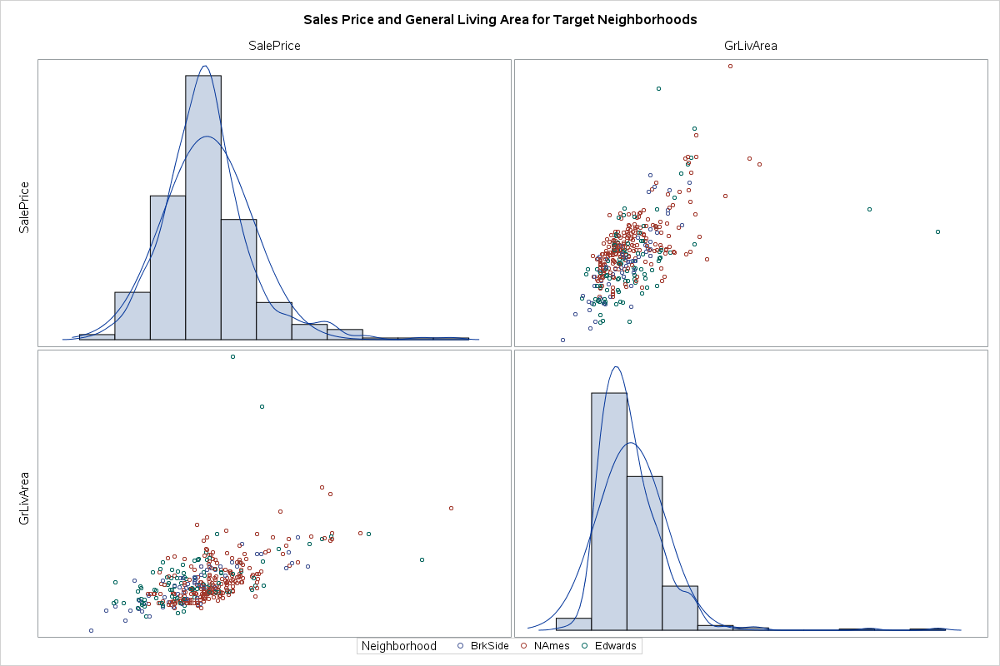
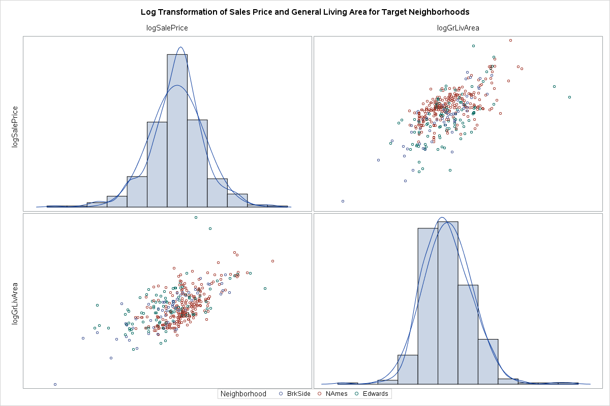
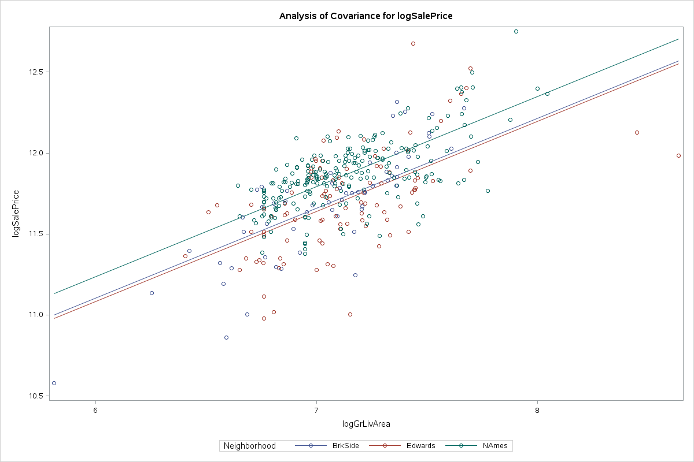
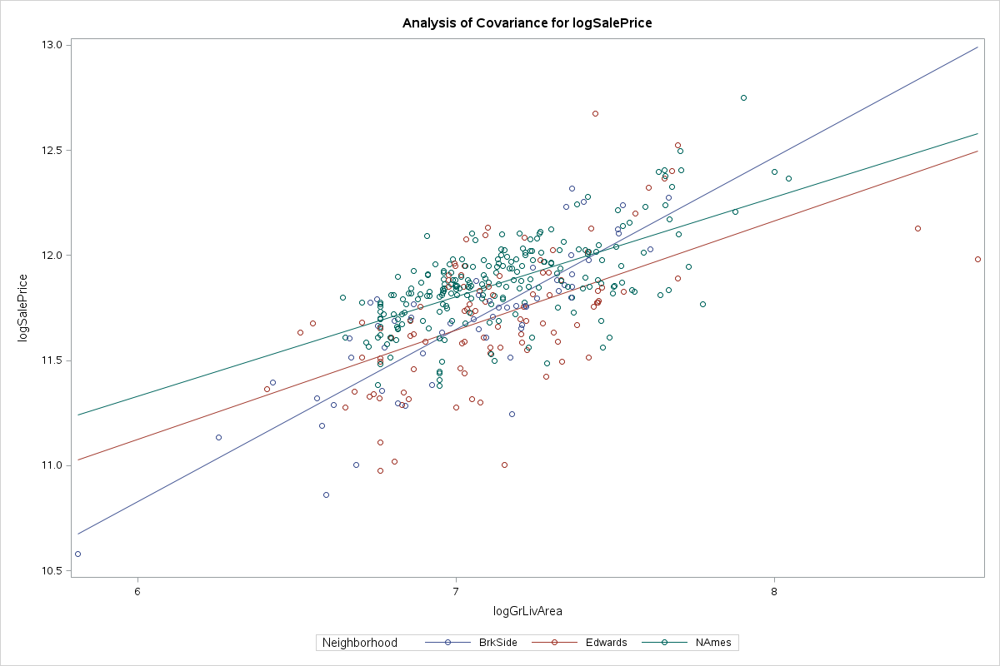
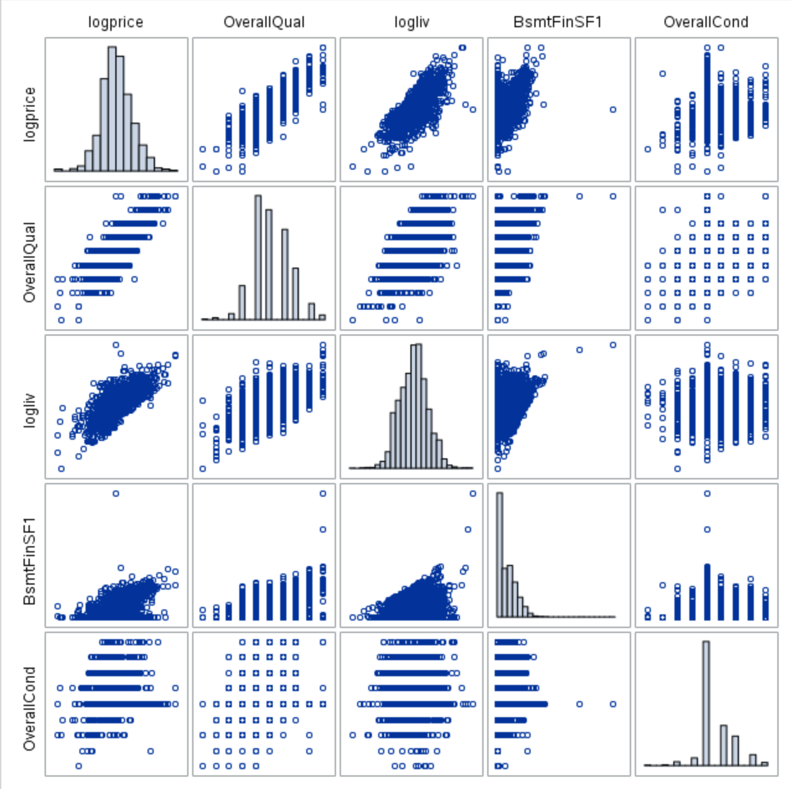
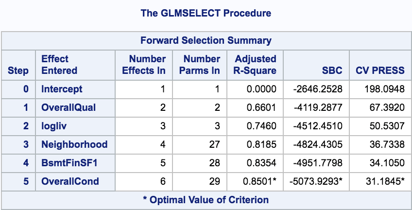
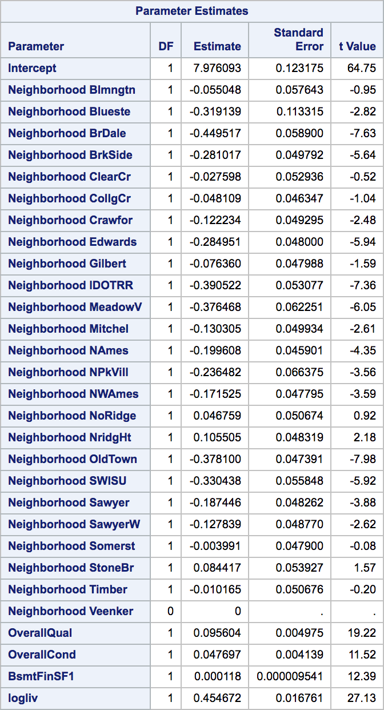

  
  
# Kaggle Project - Team Fat Tails
  
  
  
  
  
  
  
* [Kaggle Project - Team Fat Tails](#kaggle-project-team-fat-tails )
	* [Introduction](#introduction )
	* [Data Synopsis](#data-synopsis )
	* [Analysis Question 1](#analysis-question-1 )
		* [Restatement of Problem](#restatement-of-problem )
		* [Build and Fit the Model](#build-and-fit-the-model )
			* [Interrogate the Data](#interrogate-the-data )
				* [Collinearity](#collinearity )
				* [R2](#r2 )
			* [Check Assumptions](#check-assumptions )
				* [Homogeneity of Variances](#homogeneity-of-variances )
				* [Normality](#normality )
				* [Residual Diagnostics](#residual-diagnostics )
				* [Outlier Analysis](#outlier-analysis )
			* [Model Comparison](#model-comparison )
				* [No Interactions](#no-interactions )
				* [With Interactions](#with-interactions )
				* [Adj R2](#adj-r2 )
				* [Parameters & Equations](#parameters-equations )
				* [Conclusion](#conclusion )
	* [Analysis Question 2](#analysis-question-2 )
		* [Restate Problem](#restate-problem )
		* [Model Selection](#model-selection )
		* [Check Assumptions](#check-assumptions-1 )
			* [Linearity](#linearity )
			* [Heteroscedacity](#heteroscedacity )
			* [Check Normality](#check-normality )
			* [Independence](#independence )
			* [Residual Diagnostics](#residual-diagnostics-1 )
			* [Outlier Analysis](#outlier-analysis-1 )
		* [Comparing Competing Models](#comparing-competing-models )
		* [Conclusion](#conclusion-1 )
	* [Appendix A](#appendix-a )
			* [SAS Program](#sas-program )
			* [main.sas](#mainsas )
			* [dataimport.sas](#dataimportsas )
			* [procmeans.sas](#procmeanssas )
			* [analysis1_model_interactions.sas](#analysis1_model_interactionssas )
			* [analysis1_model1_nointeractions.sas](#analysis1_model1_nointeractionssas )
	* [Appendix B](#appendix-b )
		* [train_cleansed_vtarget_ntarget by Neighborhood](#train_cleansed_vtarget_ntarget-by-neighborhood )
		* [combined_cleansed_vall_ntarget](#combined_cleansed_vall_ntarget )
		* [combined_cleansed_vall_ntarget by Neighborhood](#combined_cleansed_vall_ntarget-by-neighborhood )
	* [Appendix X](#appendix-x )
	* [Appendix XX](#appendix-xx )
  
  
  
  
  
  
  
  
  
  
  
  
  
## Introduction
  
  
---
  
Ask a home buyer to describe their dream house, and they probably won't begin with the height of the basement ceiling or the proximity to an east-west railroad.   However, it is essential to review the data because it proves that there are many other influences in price negotiations than the number of bedrooms or a white-picket fence.
  
  
  
---
  
## Data Synopsis
  
  
  
  
  
The Ames House dataset was compiled by Dean De Cock and contains 79 explanatory variables describing almost every aspect of residual home in Ames Iowa from 2006 to 2010. The data set contains 2930 observations involved in assessing home values.
  
Data summary for North Ames, Edwards, and Brookside neighborhoods: 
  
| Variable     | N   | N Miss | Minimum | Maximum | Mean   | Median | Quartile Range |
|--------------|-----|--------|---------|---------|--------|--------|----------------|
| Id           | 383 | 0      | 10      | 1460    | 744    | 729    | 744            |
| MSSubClass   | 383 | 0      | 20      | 190     | 45     | 30     | 40             |
| GrLivArea    | 383 | 0      | 334     | 5642    | 1302   | 1200   | 503            |
| SalePrice    | 383 | 0      | 39300   | 345000  | 138063 | 135500 | 39000          |
| logSalePrice | 383 | 0      | 11      | 13      | 12     | 12     | 0              |
| logGrLivArea | 383 | 0      | 6       | 9       | 7      | 7      | 0              |
  
  
No Transformation            |  Log Transformation
:-------------------------:|:-------------------------:
  |  
  
  
  
  
* [More data definitions](#appendix-b )
  
---
  
## Analysis Question 1
  
  
  
  
  
  
  
  
  
  
  
  
### Restatement of Problem
  
  
  
  
  
Century 21 has commissioned Nixon, Friedrich, and Bourzikas to perform a study to derive insights regarding homes prices in Ames.  Century focuses on three neighborhoods in Ames: “North Ames”, “Edwards”, and “Brookside”. They would like to get an estimate of how the Sales Price of the house is related to the square footage of the living area of the house.  Additionally, they would like to understand the relationship between sales price and the living area square footage, as well as investigating any relationship between sales price and that home’s neighborhood.
  
### Build and Fit the Model
  
  
In order to build and fit a model, an analysis must be performed to identify features of the dataset that are statistically significant in their relation to, and prediction of, the sales price.
  
When one of the predictor variables impacts how another predictor variable is related to the dependent variable.  A multiple linear regression model in which the mean of the LogLivingArea depends linearly on the important of the LogSalesPrice and all three Neighborhoods, allowing for different slopes and intercepts, is as follow:
  
In Assessing the Fit, the coefficient is interpreted by the following models utilizing the base formula:
•	Ames^SalesPrice = β0 + β1*BrkSide + β1*Edwards + β3:*NAmes + β4 (LogLivingArea*BrkSide) + β5(LogLivingArea*Edwards)
o	β0: The intercept in this model provides an estimate 8.49 of the logGrLivArwea (reference NAmes) with a logGrLivArwea of zero. Of course, this is extrapolation and does not have a clear, practical meaning. 
o	β1: This is the adjustment of the intercept for a Neighborhood BrkSide with respect to a NAmes Neighborhood. For a Living room of zero, the Neighborhood BrkSide has an estimated Sale Price Increases of -5. 16 (2^-2.58 back transformation) dollars per square foot less than the NAmes Livingroom. 
o	β1 This is the adjustment of the intercept for a Neighborhood Edwards with respect to a NAmes Neighborhood. For a Living room of zero, the Neighborhood Edwards has an estimated Sale Price Increases of -1.40 (2^-0.49 back transformation) dollars per square foot less than the NAmes Livingroom.
o	β3: For each 1 unit increase in the Living Room of a NAmes, the estimated Sale Price increases 2^0.47 units
o	β4: For each 1 unit increase in the Living Room Size of BrkSide, the estimated Sale Price increases 8.16 (2^0.35 Back transformed) dollars per square foot from the change with the NAmes. 
o	β5: For each 1 unit increase in the Living Room Size of Edwards, the estimated Sale Price increases 1.04 (2^0.05 Back transformed) dollars per square foot from the change with the NAmes. 
  
  
  
  
---
  
#### Interrogate the Data
  
  
In reviewing the data, an analysis was performed using QQ Plots and Histograms, the linearity of the data is not in question due to the sample size, the data is right skewed and is not normally distributed as depicted, the data does not have equal standard deviations, and the data is independent of each other.
  
Because the assumptions in the data do not support evidence that will allow the study to continue due to data, transformation of the data was perfromed using the Log of the Sales Price and Log of the Grang Living Area.  Upon this transforamtion, the linearity of the data is not in question, that is not strong evidence against normalizty of residuals looking at the histogram and QQ plot, the standard deviasion appear to be equel, and the data is indpependent.   Addtionaly, there is a constant variance after the trasnformation occurred.
  
Additionaly, the it is assumped that the data is independent due to each house being unique to each neighnborhood. 
  
After the transformation, the data was interrogated and a review of the studentized residuals and Cooks D was performed by running a fit diagnostic through our Proc Reg code.    The review of Studentized residual identified one outliers that was related to a very large grand living room square footage and two outliers were related homes that have Sales price over 700,000 representing less than 0.13%.   While these data points are low leverage with big residuals, Cooks D only show a mile problem.  Due to the sample size, the Homes remained in the data set because these do not appear to affect the data.
  
##### Collinearity
  
  
Additionally, there is no collinearity in the data because Neighborhood and Grand Living are correlated with the Sales Price, if using differently each neighborhood variable as independent data.  Since these variables are correlated with each other and the response variables, it is not difficult to parse out how each will impact the response variable independently.
  
##### R2
  
  
With only an R^2 .421 and an adjusted R^2 of .418, the fit of of the model of predicting sales price by Nieghborhood and Grand Living Room square foot, is not a good model.  It is recommended that additianla variables should be used to calculate a more accute Sales Price.
  
#### Check Assumptions
  
  
##### Homogeneity of Variances
  
  
  
  
  
  
  
  
##### Normality
  
  
  
  
  
  
  
  
##### Residual Diagnostics
  
  
  
  
  
##### Outlier Analysis
  
  
  
  
  
  
  
  
  
  
  
  
---
  
#### Model Comparison
  
  
After reviewing the models after and before the transformation, the R-Square is (0.51, 0.45, respectively) with a RMSE of (0.19, 28552.30, respectively)  and a Coefficient Variance of (1.63, 20.68, respectively) ensuring the better fit is with the transformed data.
  
  
##### No Interactions
  
  
  
  
  
  
| Number of Observations Used | 383 |
|-----------------------------|-----|
  
| R-Square | Coeff Var | Root MSE | logSalePrice Mean |
|----------|-----------|----------|-------------------|
| 0.489705 | 1.66218   | 0.196118 | 11.79887          |
  
| Parameter 	| Estimate 	| Standard Error 	| t Value 	| Pr > t 	| LCL 	| UCL 	|
|----------------------	|--------------	|----------------	|---------	|--------	|--------------	|--------------	|
| Intercept 	| 7.90214954 	| 0.23133976 	| 34.16 	| <.0001 	| 7.447279361 	| 8.357019719 	|
| logGrLivArea 	| 0.555788385 	| 0.03236859 	| 17.17 	| <.0001 	| 0.492143867 	| 0.619432902 	|
| Neighborhood BrkSide 	| -0.132788629 	| 0.02906111 	| -4.57 	| <.0001 	| -0.189929827 	| -0.075647431 	|
| Neighborhood Edwards 	| -0.153226231 	| 0.02357095 	| -6.5 	| <.0001 	| -0.199572446 	| -0.106880015 	|
| Neighborhood NAmes 	| 0 	| . 	| . 	| . 	| . 	| . 	|
  

  
##### With Interactions
  
  
| Number of Observations Used | 383 |
|-----------------------------|-----|
  
| R-Square 	| Coeff Var 	| Root MSE 	| logSalePrice Mean 	|
|----------	|-----------	|----------	|-------------------	|
| 0.512092 	| 1.629617 	| 0.192276 	| 11.79887 	|
  
| Parameter 	| Estimate 	| Standard Error 	| t Value 	| Pr > t 	| LCL 	| UCL 	|
|------------------------------	|--------------	|----------------	|---------	|--------	|--------------	|--------------	|
| Intercept 	| 8.492727641 	| 0.32441709 	| 26.18 	| <.0001 	| 7.854833978 	| 9.130621305 	|
| logGrLivArea 	| 0.473023602 	| 0.04542895 	| 10.41 	| <.0001 	| 0.383697733 	| 0.562349471 	|
| Neighborhood BrkSide 	| -2.579806905 	| 0.59988132 	| -4.3 	| <.0001 	| -3.759339383 	| -1.400274428 	|
| Neighborhood Edwards 	| -0.486220461 	| 0.51750833 	| -0.94 	| 0.3481 	| -1.503784863 	| 0.531343941 	|
| Neighborhood NAmes 	| 0 	| . 	| . 	| . 	| . 	| . 	|
| logGrLivA*Neighborho BrkSide 	| 0.346624454 	| 0.08482008 	| 4.09 	| <.0001 	| 0.179844737 	| 0.513404171 	|
| logGrLivA*Neighborho Edwards 	| 0.046643642 	| 0.07248011 	| 0.64 	| 0.5203 	| -0.09587228 	| 0.189159563 	|
| logGrLivA*Neighborho NAmes 	| 0 	| . 	| . 	| . 	| . 	| . 	|
  

  
##### Adj R2
  
  
  
  
  
  
##### Parameters & Equations
  
      - Estimates
      - Interpretation 
      - Confidence Intervals 
  
Variables:
SalesPrice = SP
LivingArea = LA
  
  
  
  
  
  
  
---
  
**General Formula:**
  
<p align="center"></p>  
  
  
---
  
**Ames (North):**
  
<p align="center"></p>  
  
  
---
  
**Brookside:**
  
<p align="center"></p>  
  
  
---
  
**Edwards:**
  
<p align="center"></p>  
  
  
---
  
  
  
  
  
  
  
  
  
  
  
  
  
  
  
  
  
  
  
  
  
##### Conclusion
  
  
  
  
  
  
  
  
  
  
  
  
  
  
 To interpret the model, a change in Living Room Square Feet is a doubled increase.  For the neighborhood with approximately the same mass, it is estimate that a 10-fold increase in the Living Area Square feet is associated with a XX which is a 83.2% increase in the median Sales Price of the neighborhood. (P value < 0.001).  At a 95% confidence intervals for the increase in sales price of XX = CI which equates to an estimated increase between X% and X%.
  
  
  
  
  
  
  
---
  
## Analysis Question 2
  
  
  
  
  
  
  
  
  
  
  
  
### Restate Problem
  
  
Our objective is to build the most predictive model for sale prices of homes in Ames, Iowa using only the tools learned through week 14 of MSDS 6371.  We are to produce and compare four models:  forward selection, backward elimination, stepwise selection, and a custom model.  Models are to be evaluated on adjusted R^2, CV PRESS, and Kaggle score.  We want the model that does the best job predicting future prices (that is, best Kaggle score wins).
  
  
### Model Selection
  
  
  
  
  
Backward elimination, forward selection, stepwise selection, and custom models were built for this question.  All models were built using log-log transformed data (log of SalePrice and log of GrLivArea).  Forward selection and stepwise selection had comparable Kaggle scores.  Based on interpretability, the Forward Selection Model was chosen.
  
  
  
  
  
### Check Assumptions
  
  
  
  
Based on the lack of overwhelming evidence to support the assumptions, a number of transformations were considered and a decision was made to use a log-log transformation as the basis of the most predictive model.
  
#### Linearity
  
  
We know from the previous question that SalePrice is linearly correlated with some of the explanatory variables (size, for example), but it is unlikely to be correlated with all of them.  
  
  
  
  
#### Heteroscedacity
  
  
There is some visual evidence against constant variance.  With the large number of observations, visual inspection becomes more challenging.
  
  
  
  
#### Check Normality
  
  
A histogram of saleprice across all neighborhoods shows evidence of right skewness.
  
  
  
  
  
  
  
#### Independence
  
  
Although, homeowners are free to price their homes as they wish and buyers can make whatever offer they choose, there is no way to say with much certainty that home prices are truly independent. 
  
  
#### Residual Diagnostics
  
  
  
  
  
  
  
  
#### Outlier Analysis
  
  
  
  
  
Two observations had CooksD values significantly higher than other observations.
  
  
  
  
And no observations appeared to be particularly high leverage so we can proceed without the need to removing any observations prior to modelling.  
  
### Comparing Competing Models
  
  
| Predictive Models 	| Adjusted R2 	| CV PRESS 	| Kaggle Score 	|
|-------------------	|-------------	|----------	|--------------	|
| Forward 	| .8501 	| 31.18449 	| .14880 	|
| Backward 	| .9350 	| 31.67571 	| .21225 	|
| Stepwise 	| .9206 	| 19.14915 	| .14880 	|
| CUSTOM 	|  	|  	|  	|
  
**Best model:  Forward selection**
  
The “best” model in this situation is one that has a high degree of predictable power and is easy to interpret.  That model is the forward selection model.
  
At five explanatory variables, the forward selection model is relatively small.  It includes coefficients for OverallCond, OverallQual, BsmtFinSF1, Neighborhood and logliv.  In other words, it predicts that the price of a home is a function of its location, size, and overall condition.
  
Each neighborhood has a coefficient that acts as a multiplier for a % increase or decrease in the mean SalePrice relative to the Veenker Neighborhood (reference level selected by SAS).
  
The equation for this model is the following:
  
  
  
  
<p align="center"></p>  
  
  
  
What this means in real world terms is that a 10% increase in the above ground living area should result in an ~4.4% increase in price () due to log transforming the SalePrice and the GrLivArea variable.
  
The selection of Neighborhood impacts the mean selling price by the relative percentage of .  The mean price for Neighborhoods with negative coefficients goes down relative to the Veenker reference neighborhood.
  
For each unit increase in the OverallQual score, the mean selling price will increase by approx. 10% ().
  
For each unit increase in OverallCond score, the mean selling price will increase by approx. 4.9% ().
  
For each unit increase in BsmtFinSF1, the mean selling price will increase by approx. 0.0012% ().
  
Visually we can see that (GrLivArea) is the strongest predictor of price followed by OverallQual.  This makes sense conceptually.  It’s reasonable to assume people will pay more for a big, nice home.
  
  
  
  

  

  

  
  
  
  
### Conclusion
  
  
  
  
  
  
  
## Appendix A
  
  
  
  
  
#### SAS Program
  
  
  
  
  
#### main.sas
  
  
```sas
%INCLUDE '/home/bfriedrich0/sasuser.v94/kaggle/prod/dataimport.sas';
  
%INCLUDE '/home/bfriedrich0/sasuser.v94/kaggle/prod/procmeans.sas';
  
%INCLUDE '/home/bfriedrich0/sasuser.v94/kaggle/prod/analysis1_matrixscatterplots.sas';
  
%INCLUDE '/home/bfriedrich0/sasuser.v94/kaggle/prod/analysis1_model_interactions.sas';
  
%INCLUDE '/home/bfriedrich0/sasuser.v94/kaggle/prod/analysis1_model_nointeractions.sas';
```  
  
#### dataimport.sas
  
  
```sas
/* Import training dataset from kaggle */
proc import datafile="/home/bfriedrich0/sasuser.v94/kaggle/data/train.csv"
     out=train_original
     dbms=csv
     replace;
     getnames=yes;
run;
  
/* Import testing dataset from kaggle */
proc import datafile="/home/bfriedrich0/sasuser.v94/kaggle/data/test.csv"
     out=test_original
     dbms=csv
     replace;
     getnames=yes;
run;
  
/* Combine test and train datasets and fix column names */
data combined_original;
   set train_original test_original;
   rename 
   '1stFlrSF'n = FirstFlrSF 
   '2ndFlrSF'n = SecondFlrSF
   '3SsnPorch'n = ThreeSsnPorch;
run;
  
/* train dataset unfiltered with added calculation columns */ 
data train_cleansed_calcs;                                                                                                                      
set train_original;                                                                                                          
logSalePrice = log(SalePrice); /* natural log of SalePrice */                                                                                                             
logGrLivArea = log(GrLivArea); /* natural log of GrLivArea */
total_area = GrLivArea + GarageArea + TotalBsmtSF;
remodel_age = 2018 - YearRemodAdd;                                                                                             
run;
  
/* train dataset with ALL variables and ALL neighborhoods */  
data train_cleansed_vall_nall;                                                                                                                     
set train_cleansed_calcs;                                                                                                                                                                                                    
run;
  
/* train dataset with ALL variables and TARGET neighborhoods */
data train_cleansed_vall_ntarget;                                                                                                                      
set train_cleansed_calcs;
where Neighborhood = 'NAmes'    /* North Ames */
   or Neighborhood = 'Edwards'  /* Edwards */
   or Neighborhood = 'BrkSide'; /* Brookside */                                                                                                                                                                                                                  
run;
  
/* train dataset with TARGET variables and ALL neighborhoods */
data train_cleansed_vtarget_nall;                                                                                                                       
set train_cleansed_calcs(keep= Id MSSubClass SalePrice 
								  GrLivArea logSalePrice 
						  		  logGrLivArea Neighborhood);                                                                                                                                                                                                      
run;
  
/* train dataset with TARGET variables and TARGET neighborhoods */
data train_cleansed_vtarget_ntarget;                                                                                                                       
set train_cleansed_calcs(keep= Id MSSubClass SalePrice 
								  GrLivArea logSalePrice 
						  		  logGrLivArea Neighborhood);
where Neighborhood = 'NAmes'    /* North Ames */
   or Neighborhood = 'Edwards'  /* Edwards */
   or Neighborhood = 'BrkSide'; /* Brookside */                                                                                                                                                                                                              
run;
  
  
/* Create derivatives of the combined dataset for use in various models */
  
/* Combined dataset unfiltered with added calculation columns */
data combined_cleansed_calcs;                                                                                                                       
set combined_original; /* train_reduced */                                                                                                             
logSalePrice = log(SalePrice); /* natural log of SalePrice */                                                                                                             
logGrLivArea = log(GrLivArea); /* natural log of GrLivArea */
total_area = GrLivArea + GarageArea + TotalBsmtSF;
remodel_age = 2018 - YearRemodAdd;                                                                                                
run;
  
/* Combined dataset with ALL variables and ALL neighborhoods */ 
data combined_cleansed_vall_nall;                                                                                                                      
set combined_cleansed_calcs;                                                                                                                                                                                                    
run;
  
/* Combined dataset with ALL variables and TARGET neighborhoods */
data combined_cleansed_vall_ntarget;                                                                                                                      
set combined_cleansed_calcs;
where Neighborhood = 'NAmes'    /* North Ames */
   or Neighborhood = 'Edwards'  /* Edwards */
   or Neighborhood = 'BrkSide'; /* Brookside */                                                                                                                                                                                                                  
run;
  
/* Combined dataset with TARGET variables and ALL neighborhoods */ 
data combined_cleansed_vtarget_nall;                                                                                                                      
set combined_cleansed_calcs(keep= Id MSSubClass SalePrice 
								  GrLivArea logSalePrice 
						  		  logGrLivArea Neighborhood);                                                                                                                                                                                                      
run;
  
/* Combined dataset with TARGET variables and TARGET neighborhoods */    
data combined_cleansed_vtarget_ntarget;                                                                                                                   
set combined_cleansed_calcs(keep= Id MSSubClass SalePrice 
								  GrLivArea logSalePrice 
						  		  logGrLivArea Neighborhood); 
where Neighborhood = 'NAmes'    /* North Ames */
   or Neighborhood = 'Edwards'  /* Edwards */
   or Neighborhood = 'BrkSide'; /* Brookside */                                                                                                                                                                                                            
run;
  
  
  
  
  
  
  
  
  
  
  
  
```  
  
#### procmeans.sas
  
  
```sas
/* Generate descriptive statistics of a dataset. */
ods proctitle;
  
  
PROC MEANS
DATA=train_cleansed_vtarget_ntarget
 		MAXDEC = 0  /* Set number of decimal places in output  */
 		MISSING		/*   */
		N	 		/*   */
		NMISS 		/*   */
		MIN 		/*   */
		MAX 		/*   */
		MEAN 		/*   */
		MEDIAN 		/*   */
		QRANGE		/* IQR  */
		;
OUTPUT 
OUT=train_reduced_means 
NMISS= 
N= 
MEAN= 
SUM= 
MEDIAN= 
QRANGE=
/AUTONAME /* Prefix output columns with variable name */
; 
TITLE 'train_cleansed_vtarget_ntarget';
run;
  
  
PROC MEANS
DATA=train_cleansed_vtarget_ntarget
 		MAXDEC = 0  /* Set number of decimal places in output  */
 		MISSING		/*   */
		N	 		/*   */
		NMISS 		/*   */
		MIN 		/*   */
		MAX 		/*   */
		MEAN 		/*   */
		MEDIAN 		/*   */
		QRANGE		/* IQR  */
		;
CLASS Neighborhood; /* YrSold; */
OUTPUT 
OUT=train_reduced_means 
NMISS= 
N= 
MEAN= 
SUM= 
MEDIAN= 
QRANGE=
/AUTONAME /* Prefix output columns with variable name */
; 
TITLE 'train_cleansed_vtarget_ntarget by Neighborhood';
run;
  
  
PROC MEANS
DATA=combined_cleansed_vall_ntarget
 		MAXDEC = 0  /* Set number of decimal places in output  */
 		MISSING		/*   */
		N	 		/*   */
		NMISS 		/*   */
		MIN 		/*   */
		MAX 		/*   */
		MEAN 		/*   */
		MEDIAN 		/*   */
		QRANGE		/* IQR  */
		;
OUTPUT 
OUT=train_reduced_means 
NMISS= 
N= 
MEAN= 
SUM= 
MEDIAN= 
QRANGE=
/AUTONAME /* Prefix output columns with variable name */
; 
TITLE 'combined_cleansed_vall_ntarget';
run;
  
  
PROC MEANS
DATA=combined_cleansed_vall_ntarget
 		MAXDEC = 0  /* Set number of decimal places in output  */
 		MISSING		/*   */
		N	 		/*   */
		NMISS 		/*   */
		MIN 		/*   */
		MAX 		/*   */
		MEAN 		/*   */
		MEDIAN 		/*   */
		QRANGE		/* IQR  */
		;
CLASS Neighborhood; /* YrSold; */
OUTPUT 
OUT=train_reduced_means 
NMISS= 
N= 
MEAN= 
SUM= 
MEDIAN= 
QRANGE=
/AUTONAME /* Prefix output columns with variable name */
; 
TITLE 'combined_cleansed_vall_ntarget by Neighborhood';
run;
```  
  
#### analysis1_model_interactions.sas
  
  
```sas
proc glm data = train_cleansed_vtarget_ntarget plots = all;
class Neighborhood(ref='NAmes');
model logSalePrice = logGrLIvArea | Neighborhood / CLPARM solution;
output out = t student=res cookd = cookd h = lev p = yhat;
ods select all;
run;
  
  
proc reg data=train_cleansed_vtarget_ntarget
      plots(label)=(CooksD RStudentByLeverage DFFITS DFBETAS);   
   id id;
   model logSalePrice = logGrLIvArea;
run;
  
  
```  
  
#### analysis1_model1_nointeractions.sas
  
  
```sas
proc glm data = train_cleansed_vtarget_ntarget plots = all;
class Neighborhood(ref='NAmes');
model logSalePrice = logGrLIvArea | Neighborhood / CLPARM solution;
output out = t student=res cookd = cookd h = lev p = yhat;
ods select all;
run;
  
  
proc reg data=train_cleansed_vtarget_ntarget
      plots(label)=(CooksD RStudentByLeverage DFFITS DFBETAS);   
   id id;
   model logSalePrice = logGrLIvArea;
run;
  
  
```  
  
  
  
## Appendix B
  
  
### train_cleansed_vtarget_ntarget by Neighborhood
  
  
| Neighborhood | N Obs | Variable     | N   | N Miss | Minimum | Maximum | Mean   | Median | Quartile Range |
|--------------|-------|--------------|-----|--------|---------|---------|--------|--------|----------------|
| BrkSide      | 58    | Id           | 58  | 0      | 10      | 1444    | 735    | 696    | 746            |
|              |       | MSSubClass   | 58  | 0      | 20      | 190     | 50     | 50     | 20             |
|              |       | GrLivArea    | 58  | 0      | 334     | 2134    | 1203   | 1211   | 638            |
|              |       | SalePrice    | 58  | 0      | 39300   | 223500  | 124834 | 124300 | 41500          |
|              |       | logSalePrice | 58  | 0      | 11      | 12      | 12     | 12     | 0              |
|              |       | logGrLivArea | 58  | 0      | 6       | 8       | 7      | 7      | 1              |
| Edwards      | 100   | Id           | 100 | 0      | 40      | 1460    | 763    | 732    | 720            |
|              |       | MSSubClass   | 100 | 0      | 20      | 190     | 57     | 50     | 55             |
|              |       | GrLivArea    | 100 | 0      | 605     | 5642    | 1340   | 1200   | 499            |
|              |       | SalePrice    | 100 | 0      | 58500   | 320000  | 128220 | 121750 | 44450          |
|              |       | logSalePrice | 100 | 0      | 11      | 13      | 12     | 12     | 0              |
|              |       | logGrLivArea | 100 | 0      | 6       | 9       | 7      | 7      | 0              |
| NAmes        | 225   | Id           | 225 | 0      | 15      | 1459    | 738    | 761    | 737            |
|              |       | MSSubClass   | 225 | 0      | 20      | 190     | 39     | 20     | 40             |
|              |       | GrLivArea    | 225 | 0      | 767     | 3112    | 1310   | 1200   | 439            |
|              |       | SalePrice    | 225 | 0      | 87500   | 345000  | 145847 | 140000 | 30500          |
|              |       | logSalePrice | 225 | 0      | 11      | 13      | 12     | 12     | 0              |
|              |       | logGrLivArea | 225 | 0      | 7       | 8       | 7      | 7      | 0              |
  
### combined_cleansed_vall_ntarget
  
  
| Variable      | N   | N Miss | Minimum | Maximum | Mean   | Median | Quartile Range |
|---------------|-----|--------|---------|---------|--------|--------|----------------|
| Id            | 745 | 0      | 10      | 2873    | 1454   | 1425   | 1470           |
| MSSubClass    | 745 | 0      | 20      | 190     | 44     | 30     | 40             |
| LotArea       | 745 | 0      | 2522    | 63887   | 9675   | 9020   | 3117           |
| OverallQual   | 745 | 0      | 1       | 10      | 5      | 5      | 1              |
| OverallCond   | 745 | 0      | 1       | 9       | 6      | 6      | 2              |
| YearBuilt     | 745 | 0      | 1900    | 2009    | 1955   | 1957   | 16             |
| YearRemodAdd  | 745 | 0      | 1950    | 2010    | 1971   | 1964   | 39             |
| MasVnrArea    | 744 | 1      | 0       | 1224    | 69     | 0      | 91             |
| BsmtFinSF1    | 744 | 1      | 0       | 5644    | 424    | 399    | 652            |
| BsmtFinSF2    | 744 | 1      | 0       | 1164    | 65     | 0      | 0              |
| BsmtUnfSF     | 744 | 1      | 0       | 1866    | 466    | 414    | 529            |
| TotalBsmtSF   | 744 | 1      | 0       | 6110    | 955    | 952    | 356            |
| FirstFlrSF    | 745 | 0      | 334     | 5095    | 1120   | 1054   | 345            |
| SecondFlrSF   | 745 | 0      | 0       | 1836    | 172    | 0      | 328            |
| LowQualFinSF  | 745 | 0      | 0       | 512     | 4      | 0      | 0              |
| GrLivArea     | 745 | 0      | 334     | 5642    | 1296   | 1200   | 454            |
| BsmtFullBath  | 743 | 2      | 0       | 3       | 0      | 0      | 1              |
| BsmtHalfBath  | 743 | 2      | 0       | 2       | 0      | 0      | 0              |
| FullBath      | 745 | 0      | 0       | 3       | 1      | 1      | 0              |
| HalfBath      | 745 | 0      | 0       | 2       | 0      | 0      | 0              |
| BedroomAbvGr  | 745 | 0      | 1       | 6       | 3      | 3      | 1              |
| KitchenAbvGr  | 745 | 0      | 0       | 2       | 1      | 1      | 0              |
| TotRmsAbvGrd  | 745 | 0      | 2       | 15      | 6      | 6      | 2              |
| Fireplaces    | 745 | 0      | 0       | 3       | 0      | 0      | 1              |
| GarageYrBlt   | 686 | 59     | 1910    | 2009    | 1962   | 1960   | 16             |
| GarageCars    | 745 | 0      | 0       | 5       | 1      | 1      | 1              |
| GarageArea    | 745 | 0      | 0       | 1418    | 385    | 364    | 226            |
| WoodDeckSF    | 745 | 0      | 0       | 736     | 62     | 0      | 104            |
| OpenPorchSF   | 745 | 0      | 0       | 484     | 30     | 0      | 40             |
| EnclosedPorch | 745 | 0      | 0       | 552     | 25     | 0      | 0              |
| ThreeSsnPorch | 745 | 0      | 0       | 407     | 3      | 0      | 0              |
| ScreenPorch   | 745 | 0      | 0       | 576     | 22     | 0      | 0              |
| PoolArea      | 745 | 0      | 0       | 738     | 3      | 0      | 0              |
| MiscVal       | 745 | 0      | 0       | 17000   | 109    | 0      | 0              |
| MoSold        | 745 | 0      | 1       | 12      | 6      | 6      | 4              |
| YrSold        | 745 | 0      | 2006    | 2010    | 2008   | 2008   | 2              |
| SalePrice     | 383 | 362    | 39300   | 345000  | 138063 | 135500 | 39000          |
| logSalePrice  | 383 | 362    | 11      | 13      | 12     | 12     | 0              |
| logGrLivArea  | 745 | 0      | 6       | 9       | 7      | 7      | 0              |
| total_area    | 744 | 1      | 334     | 13170   | 2636   | 2554   | 804            |
| remodel_age   | 745 | 0      | 8       | 68      | 47     | 54     | 39             |
  
### combined_cleansed_vall_ntarget by Neighborhood
  
  
| Neighborhood | N Obs | Variable      | N   | N Miss | Minimum | Maximum | Mean   | Median | Quartile Range |
|--------------|-------|---------------|-----|--------|---------|---------|--------|--------|----------------|
| BrkSide      | 108   | Id            | 108 | 0      | 10      | 2796    | 1378   | 1394   | 1503           |
|              |       | MSSubClass    | 108 | 0      | 20      | 190     | 49     | 50     | 20             |
|              |       | LotArea       | 108 | 0      | 3500    | 21384   | 6960   | 6168   | 1342           |
|              |       | OverallQual   | 108 | 0      | 1       | 7       | 5      | 5      | 1              |
|              |       | OverallCond   | 108 | 0      | 2       | 9       | 6      | 6      | 2              |
|              |       | YearBuilt     | 108 | 0      | 1900    | 1970    | 1932   | 1930   | 15             |
|              |       | YearRemodAdd  | 108 | 0      | 1950    | 2008    | 1968   | 1950   | 45             |
|              |       | MasVnrArea    | 108 | 0      | 0       | 444     | 11     | 0      | 0              |
|              |       | BsmtFinSF1    | 107 | 1      | 0       | 1309    | 201    | 68     | 336            |
|              |       | BsmtFinSF2    | 107 | 1      | 0       | 606     | 20     | 0      | 0              |
|              |       | BsmtUnfSF     | 107 | 1      | 0       | 1078    | 543    | 524    | 537            |
|              |       | TotalBsmtSF   | 107 | 1      | 0       | 1324    | 764    | 788    | 277            |
|              |       | FirstFlrSF    | 108 | 0      | 334     | 1445    | 899    | 901    | 235            |
|              |       | SecondFlrSF   | 108 | 0      | 0       | 908     | 331    | 399    | 583            |
|              |       | LowQualFinSF  | 108 | 0      | 0       | 360     | 5      | 0      | 0              |
|              |       | GrLivArea     | 108 | 0      | 334     | 2134    | 1235   | 1231   | 559            |
|              |       | BsmtFullBath  | 107 | 1      | 0       | 2       | 0      | 0      | 0              |
|              |       | BsmtHalfBath  | 107 | 1      | 0       | 1       | 0      | 0      | 0              |
|              |       | FullBath      | 108 | 0      | 1       | 2       | 1      | 1      | 0              |
|              |       | HalfBath      | 108 | 0      | 0       | 1       | 0      | 0      | 0              |
|              |       | BedroomAbvGr  | 108 | 0      | 1       | 5       | 3      | 3      | 1              |
|              |       | KitchenAbvGr  | 108 | 0      | 1       | 2       | 1      | 1      | 0              |
|              |       | TotRmsAbvGrd  | 108 | 0      | 2       | 10      | 6      | 6      | 1              |
|              |       | Fireplaces    | 108 | 0      | 0       | 2       | 0      | 0      | 1              |
|              |       | GarageYrBlt   | 96  | 12     | 1916    | 2004    | 1948   | 1940   | 37             |
|              |       | GarageCars    | 108 | 0      | 0       | 5       | 1      | 1      | 1              |
|              |       | GarageArea    | 108 | 0      | 0       | 1184    | 314    | 280    | 224            |
|              |       | WoodDeckSF    | 108 | 0      | 0       | 509     | 46     | 0      | 42             |
|              |       | OpenPorchSF   | 108 | 0      | 0       | 365     | 25     | 0      | 18             |
|              |       | EnclosedPorch | 108 | 0      | 0       | 268     | 39     | 0      | 70             |
|              |       | ThreeSsnPorch | 108 | 0      | 0       | 150     | 3      | 0      | 0              |
|              |       | ScreenPorch   | 108 | 0      | 0       | 259     | 14     | 0      | 0              |
|              |       | PoolArea      | 108 | 0      | 0       | 0       | 0      | 0      | 0              |
|              |       | MiscVal       | 108 | 0      | 0       | 2000    | 41     | 0      | 0              |
|              |       | MoSold        | 108 | 0      | 1       | 12      | 6      | 6      | 3              |
|              |       | YrSold        | 108 | 0      | 2006    | 2010    | 2008   | 2008   | 2              |
|              |       | SalePrice     | 58  | 50     | 39300   | 223500  | 124834 | 124300 | 41500          |
|              |       | logSalePrice  | 58  | 50     | 11      | 12      | 12     | 12     | 0              |
|              |       | logGrLivArea  | 108 | 0      | 6       | 8       | 7      | 7      | 0              |
|              |       | total_area    | 107 | 1      | 334     | 3491    | 2316   | 2321   | 776            |
|              |       | remodel_age   | 108 | 0      | 10      | 68      | 50     | 68     | 45             |
| Edwards      | 194   | Id            | 194 | 0      | 40      | 2873    | 1515   | 1437   | 1473           |
|              |       | MSSubClass    | 194 | 0      | 20      | 190     | 55     | 50     | 60             |
|              |       | LotArea       | 194 | 0      | 2522    | 63887   | 10356  | 9345   | 3281           |
|              |       | OverallQual   | 194 | 0      | 1       | 10      | 5      | 5      | 2              |
|              |       | OverallCond   | 194 | 0      | 1       | 9       | 6      | 5      | 1              |
|              |       | YearBuilt     | 194 | 0      | 1900    | 2009    | 1957   | 1954   | 31             |
|              |       | YearRemodAdd  | 194 | 0      | 1950    | 2010    | 1974   | 1968   | 47             |
|              |       | MasVnrArea    | 193 | 1      | 0       | 1224    | 50     | 0      | 48             |
|              |       | BsmtFinSF1    | 194 | 0      | 0       | 5644    | 410    | 289    | 609            |
|              |       | BsmtFinSF2    | 194 | 0      | 0       | 1164    | 47     | 0      | 0              |
|              |       | BsmtUnfSF     | 194 | 0      | 0       | 1678    | 429    | 392    | 606            |
|              |       | TotalBsmtSF   | 194 | 0      | 0       | 6110    | 885    | 864    | 434            |
|              |       | FirstFlrSF    | 194 | 0      | 495     | 5095    | 1115   | 1056   | 331            |
|              |       | SecondFlrSF   | 194 | 0      | 0       | 1836    | 218    | 0      | 462            |
|              |       | LowQualFinSF  | 194 | 0      | 0       | 450     | 4      | 0      | 0              |
|              |       | GrLivArea     | 194 | 0      | 498     | 5642    | 1338   | 1196   | 429            |
|              |       | BsmtFullBath  | 193 | 1      | 0       | 3       | 0      | 0      | 1              |
|              |       | BsmtHalfBath  | 193 | 1      | 0       | 2       | 0      | 0      | 0              |
|              |       | FullBath      | 194 | 0      | 0       | 3       | 1      | 1      | 1              |
|              |       | HalfBath      | 194 | 0      | 0       | 2       | 0      | 0      | 0              |
|              |       | BedroomAbvGr  | 194 | 0      | 1       | 6       | 3      | 3      | 1              |
|              |       | KitchenAbvGr  | 194 | 0      | 0       | 2       | 1      | 1      | 0              |
|              |       | TotRmsAbvGrd  | 194 | 0      | 3       | 15      | 6      | 6      | 2              |
|              |       | Fireplaces    | 194 | 0      | 0       | 3       | 0      | 0      | 1              |
|              |       | GarageYrBlt   | 157 | 37     | 1910    | 2009    | 1966   | 1958   | 29             |
|              |       | GarageCars    | 194 | 0      | 0       | 3       | 1      | 1      | 1              |
|              |       | GarageArea    | 194 | 0      | 0       | 1418    | 336    | 321    | 268            |
|              |       | WoodDeckSF    | 194 | 0      | 0       | 736     | 71     | 0      | 120            |
|              |       | OpenPorchSF   | 194 | 0      | 0       | 484     | 34     | 0      | 40             |
|              |       | EnclosedPorch | 194 | 0      | 0       | 286     | 25     | 0      | 0              |
|              |       | ThreeSsnPorch | 194 | 0      | 0       | 180     | 1      | 0      | 0              |
|              |       | ScreenPorch   | 194 | 0      | 0       | 576     | 17     | 0      | 0              |
|              |       | PoolArea      | 194 | 0      | 0       | 738     | 6      | 0      | 0              |
|              |       | MiscVal       | 194 | 0      | 0       | 17000   | 123    | 0      | 0              |
|              |       | MoSold        | 194 | 0      | 1       | 12      | 6      | 6      | 3              |
|              |       | YrSold        | 194 | 0      | 2006    | 2010    | 2008   | 2008   | 2              |
|              |       | SalePrice     | 100 | 94     | 58500   | 320000  | 128220 | 121750 | 44450          |
|              |       | logSalePrice  | 100 | 94     | 11      | 13      | 12     | 12     | 0              |
|              |       | logGrLivArea  | 194 | 0      | 6       | 9       | 7      | 7      | 0              |
|              |       | total_area    | 194 | 0      | 880     | 13170   | 2559   | 2439   | 948            |
|              |       | remodel_age   | 194 | 0      | 8       | 68      | 44     | 50     | 47             |
| NAmes        | 443   | Id            | 443 | 0      | 15      | 2772    | 1446   | 1436   | 1345           |
|              |       | MSSubClass    | 443 | 0      | 20      | 190     | 38     | 20     | 30             |
|              |       | LotArea       | 443 | 0      | 4058    | 39384   | 10040  | 9500   | 2786           |
|              |       | OverallQual   | 443 | 0      | 3       | 8       | 5      | 5      | 1              |
|              |       | OverallCond   | 443 | 0      | 3       | 9       | 6      | 6      | 2              |
|              |       | YearBuilt     | 443 | 0      | 1918    | 2003    | 1960   | 1959   | 10             |
|              |       | YearRemodAdd  | 443 | 0      | 1950    | 2009    | 1971   | 1964   | 26             |
|              |       | MasVnrArea    | 443 | 0      | 0       | 1115    | 92     | 0      | 151            |
|              |       | BsmtFinSF1    | 443 | 0      | 0       | 1880    | 484    | 500    | 521            |
|              |       | BsmtFinSF2    | 443 | 0      | 0       | 1029    | 84     | 0      | 0              |
|              |       | BsmtUnfSF     | 443 | 0      | 0       | 1866    | 463    | 398    | 444            |
|              |       | TotalBsmtSF   | 443 | 0      | 0       | 2223    | 1031   | 1031   | 341            |
|              |       | FirstFlrSF    | 443 | 0      | 576     | 2223    | 1175   | 1107   | 385            |
|              |       | SecondFlrSF   | 443 | 0      | 0       | 1778    | 113    | 0      | 0              |
|              |       | LowQualFinSF  | 443 | 0      | 0       | 512     | 4      | 0      | 0              |
|              |       | GrLivArea     | 443 | 0      | 715     | 3112    | 1292   | 1200   | 452            |
|              |       | BsmtFullBath  | 443 | 0      | 0       | 2       | 0      | 0      | 1              |
|              |       | BsmtHalfBath  | 443 | 0      | 0       | 1       | 0      | 0      | 0              |
|              |       | FullBath      | 443 | 0      | 1       | 3       | 1      | 1      | 0              |
|              |       | HalfBath      | 443 | 0      | 0       | 2       | 0      | 0      | 0              |
|              |       | BedroomAbvGr  | 443 | 0      | 1       | 6       | 3      | 3      | 1              |
|              |       | KitchenAbvGr  | 443 | 0      | 1       | 2       | 1      | 1      | 0              |
|              |       | TotRmsAbvGrd  | 443 | 0      | 4       | 12      | 6      | 6      | 1              |
|              |       | Fireplaces    | 443 | 0      | 0       | 3       | 1      | 0      | 1              |
|              |       | GarageYrBlt   | 433 | 10     | 1918    | 2008    | 1964   | 1961   | 12             |
|              |       | GarageCars    | 443 | 0      | 0       | 4       | 2      | 2      | 1              |
|              |       | GarageArea    | 443 | 0      | 0       | 1200    | 423    | 418    | 223            |
|              |       | WoodDeckSF    | 443 | 0      | 0       | 657     | 63     | 0      | 108            |
|              |       | OpenPorchSF   | 443 | 0      | 0       | 319     | 30     | 0      | 40             |
|              |       | EnclosedPorch | 443 | 0      | 0       | 552     | 21     | 0      | 0              |
|              |       | ThreeSsnPorch | 443 | 0      | 0       | 407     | 4      | 0      | 0              |
|              |       | ScreenPorch   | 443 | 0      | 0       | 385     | 26     | 0      | 0              |
|              |       | PoolArea      | 443 | 0      | 0       | 512     | 2      | 0      | 0              |
|              |       | MiscVal       | 443 | 0      | 0       | 15500   | 119    | 0      | 0              |
|              |       | MoSold        | 443 | 0      | 1       | 12      | 6      | 6      | 3              |
|              |       | YrSold        | 443 | 0      | 2006    | 2010    | 2008   | 2008   | 2              |
|              |       | SalePrice     | 225 | 218    | 87500   | 345000  | 145847 | 140000 | 30500          |
|              |       | logSalePrice  | 225 | 218    | 11      | 13      | 12     | 12     | 0              |
|              |       | logGrLivArea  | 443 | 0      | 7       | 8       | 7      | 7      | 0              |
|              |       | total_area    | 443 | 0      | 1176    | 5267    | 2747   | 2662   | 789            |
|              |       | remodel_age   | 443 | 0      | 9       | 68      | 47     | 54     | 26             |
  
  
## Appendix X
  
  
  
  
  
  
MSSubClass: Identifies the type of dwelling involved in the sale.	
  
        20	1-STORY 1946 & NEWER ALL STYLES
        30	1-STORY 1945 & OLDER
        40	1-STORY W/FINISHED ATTIC ALL AGES
        45	1-1/2 STORY - UNFINISHED ALL AGES
        50	1-1/2 STORY FINISHED ALL AGES
        60	2-STORY 1946 & NEWER
        70	2-STORY 1945 & OLDER
        75	2-1/2 STORY ALL AGES
        80	SPLIT OR MULTI-LEVEL
        85	SPLIT FOYER
        90	DUPLEX - ALL STYLES AND AGES
       120	1-STORY PUD (Planned Unit Development) - 1946 & NEWER
       150	1-1/2 STORY PUD - ALL AGES
       160	2-STORY PUD - 1946 & NEWER
       180	PUD - MULTILEVEL - INCL SPLIT LEV/FOYER
       190	2 FAMILY CONVERSION - ALL STYLES AND AGES
  
MSZoning: Identifies the general zoning classification of the sale.
  
       A	Agriculture
       C	Commercial
       FV	Floating Village Residential
       I	Industrial
       RH	Residential High Density
       RL	Residential Low Density
       RP	Residential Low Density Park 
       RM	Residential Medium Density
  
LotFrontage: Linear feet of street connected to property
  
LotArea: Lot size in square feet
  
Street: Type of road access to property
  
       Grvl	Gravel	
       Pave	Paved
  
Alley: Type of alley access to property
  
       Grvl	Gravel
       Pave	Paved
       NA 	No alley access
  
LotShape: General shape of property
  
       Reg	Regular	
       IR1	Slightly irregular
       IR2	Moderately Irregular
       IR3	Irregular
  
LandContour: Flatness of the property
  
       Lvl	Near Flat/Level	
       Bnk	Banked - Quick and significant rise from street grade to building
       HLS	Hillside - Significant slope from side to side
       Low	Depression
  
Utilities: Type of utilities available
  
       AllPub	All public Utilities (E,G,W,& S)	
       NoSewr	Electricity, Gas, and Water (Septic Tank)
       NoSeWa	Electricity and Gas Only
       ELO	Electricity only	
  
LotConfig: Lot configuration
  
       Inside	Inside lot
       Corner	Corner lot
       CulDSac	Cul-de-sac
       FR2	Frontage on 2 sides of property
       FR3	Frontage on 3 sides of property
  
LandSlope: Slope of property
  
       Gtl	Gentle slope
       Mod	Moderate Slope	
       Sev	Severe Slope
  
Neighborhood: Physical locations within Ames city limits
  
       Blmngtn	Bloomington Heights
       Blueste	Bluestem
       BrDale	Briardale
       BrkSide	Brookside
       ClearCr	Clear Creek
       CollgCr	College Creek
       Crawfor	Crawford
       Edwards	Edwards
       Gilbert	Gilbert
       IDOTRR	Iowa DOT and Rail Road
       MeadowV	Meadow Village
       Mitchel	Mitchell
       Names	North Ames
       NoRidge	Northridge
       NPkVill	Northpark Villa
       NridgHt	Northridge Heights
       NWAmes	Northwest Ames
       OldTown	Old Town
       SWISU	South & West of Iowa State University
       Sawyer	Sawyer
       SawyerW	Sawyer West
       Somerst	Somerset
       StoneBr	Stone Brook
       Timber	Timberland
       Veenker	Veenker
  
Condition1: Proximity to various conditions
  
       Artery	Adjacent to arterial street
       Feedr	Adjacent to feeder street	
       Norm	Normal	
       RRNn	Within 200' of North-South Railroad
       RRAn	Adjacent to North-South Railroad
       PosN	Near positive off-site feature--park, greenbelt, etc.
       PosA	Adjacent to postive off-site feature
       RRNe	Within 200' of East-West Railroad
       RRAe	Adjacent to East-West Railroad
  
Condition2: Proximity to various conditions (if more than one is present)
  
       Artery	Adjacent to arterial street
       Feedr	Adjacent to feeder street	
       Norm	Normal	
       RRNn	Within 200' of North-South Railroad
       RRAn	Adjacent to North-South Railroad
       PosN	Near positive off-site feature--park, greenbelt, etc.
       PosA	Adjacent to postive off-site feature
       RRNe	Within 200' of East-West Railroad
       RRAe	Adjacent to East-West Railroad
  
BldgType: Type of dwelling
  
       1Fam	Single-family Detached	
       2FmCon	Two-family Conversion; originally built as one-family dwelling
       Duplx	Duplex
       TwnhsE	Townhouse End Unit
       TwnhsI	Townhouse Inside Unit
  
HouseStyle: Style of dwelling
  
       1Story	One story
       1.5Fin	One and one-half story: 2nd level finished
       1.5Unf	One and one-half story: 2nd level unfinished
       2Story	Two story
       2.5Fin	Two and one-half story: 2nd level finished
       2.5Unf	Two and one-half story: 2nd level unfinished
       SFoyer	Split Foyer
       SLvl	Split Level
  
OverallQual: Rates the overall material and finish of the house
  
       10	Very Excellent
       9	Excellent
       8	Very Good
       7	Good
       6	Above Average
       5	Average
       4	Below Average
       3	Fair
       2	Poor
       1	Very Poor
  
OverallCond: Rates the overall condition of the house
  
       10	Very Excellent
       9	Excellent
       8	Very Good
       7	Good
       6	Above Average	
       5	Average
       4	Below Average	
       3	Fair
       2	Poor
       1	Very Poor
  
YearBuilt: Original construction date
  
YearRemodAdd: Remodel date (same as construction date if no remodeling or additions)
  
RoofStyle: Type of roof
  
       Flat	Flat
       Gable	Gable
       Gambrel	Gabrel (Barn)
       Hip	Hip
       Mansard	Mansard
       Shed	Shed
  
RoofMatl: Roof material
  
       ClyTile	Clay or Tile
       CompShg	Standard (Composite) Shingle
       Membran	Membrane
       Metal	Metal
       Roll	Roll
       Tar&Grv	Gravel & Tar
       WdShake	Wood Shakes
       WdShngl	Wood Shingles
  
Exterior1st: Exterior covering on house
  
       AsbShng	Asbestos Shingles
       AsphShn	Asphalt Shingles
       BrkComm	Brick Common
       BrkFace	Brick Face
       CBlock	Cinder Block
       CemntBd	Cement Board
       HdBoard	Hard Board
       ImStucc	Imitation Stucco
       MetalSd	Metal Siding
       Other	Other
       Plywood	Plywood
       PreCast	PreCast	
       Stone	Stone
       Stucco	Stucco
       VinylSd	Vinyl Siding
       Wd Sdng	Wood Siding
       WdShing	Wood Shingles
  
Exterior2nd: Exterior covering on house (if more than one material)
  
       AsbShng	Asbestos Shingles
       AsphShn	Asphalt Shingles
       BrkComm	Brick Common
       BrkFace	Brick Face
       CBlock	Cinder Block
       CemntBd	Cement Board
       HdBoard	Hard Board
       ImStucc	Imitation Stucco
       MetalSd	Metal Siding
       Other	Other
       Plywood	Plywood
       PreCast	PreCast
       Stone	Stone
       Stucco	Stucco
       VinylSd	Vinyl Siding
       Wd Sdng	Wood Siding
       WdShing	Wood Shingles
  
MasVnrType: Masonry veneer type
  
       BrkCmn	Brick Common
       BrkFace	Brick Face
       CBlock	Cinder Block
       None	None
       Stone	Stone
  
MasVnrArea: Masonry veneer area in square feet
  
ExterQual: Evaluates the quality of the material on the exterior 
  
       Ex	Excellent
       Gd	Good
       TA	Average/Typical
       Fa	Fair
       Po	Poor
  
ExterCond: Evaluates the present condition of the material on the exterior
  
       Ex	Excellent
       Gd	Good
       TA	Average/Typical
       Fa	Fair
       Po	Poor
  
Foundation: Type of foundation
  
       BrkTil	Brick & Tile
       CBlock	Cinder Block
       PConc	Poured Contrete	
       Slab	Slab
       Stone	Stone
       Wood	Wood
  
BsmtQual: Evaluates the height of the basement
  
       Ex	Excellent (100+ inches)	
       Gd	Good (90-99 inches)
       TA	Typical (80-89 inches)
       Fa	Fair (70-79 inches)
       Po	Poor (<70 inches
       NA	No Basement
  
BsmtCond: Evaluates the general condition of the basement
  
       Ex	Excellent
       Gd	Good
       TA	Typical - slight dampness allowed
       Fa	Fair - dampness or some cracking or settling
       Po	Poor - Severe cracking, settling, or wetness
       NA	No Basement
  
BsmtExposure: Refers to walkout or garden level walls
  
       Gd	Good Exposure
       Av	Average Exposure (split levels or foyers typically score average or above)	
       Mn	Mimimum Exposure
       No	No Exposure
       NA	No Basement
  
BsmtFinType1: Rating of basement finished area
  
       GLQ	Good Living Quarters
       ALQ	Average Living Quarters
       BLQ	Below Average Living Quarters	
       Rec	Average Rec Room
       LwQ	Low Quality
       Unf	Unfinshed
       NA	No Basement
  
BsmtFinSF1: Type 1 finished square feet
  
BsmtFinType2: Rating of basement finished area (if multiple types)
  
       GLQ	Good Living Quarters
       ALQ	Average Living Quarters
       BLQ	Below Average Living Quarters	
       Rec	Average Rec Room
       LwQ	Low Quality
       Unf	Unfinshed
       NA	No Basement
  
BsmtFinSF2: Type 2 finished square feet
  
BsmtUnfSF: Unfinished square feet of basement area
  
TotalBsmtSF: Total square feet of basement area
  
Heating: Type of heating
  
       Floor	Floor Furnace
       GasA	Gas forced warm air furnace
       GasW	Gas hot water or steam heat
       Grav	Gravity furnace	
       OthW	Hot water or steam heat other than gas
       Wall	Wall furnace
  
HeatingQC: Heating quality and condition
  
       Ex	Excellent
       Gd	Good
       TA	Average/Typical
       Fa	Fair
       Po	Poor
  
CentralAir: Central air conditioning
  
       N	No
       Y	Yes
  
Electrical: Electrical system
  
       SBrkr	Standard Circuit Breakers & Romex
       FuseA	Fuse Box over 60 AMP and all Romex wiring (Average)	
       FuseF	60 AMP Fuse Box and mostly Romex wiring (Fair)
       FuseP	60 AMP Fuse Box and mostly knob & tube wiring (poor)
       Mix	Mixed
  
1stFlrSF: First Floor square feet
  
2ndFlrSF: Second floor square feet
  
LowQualFinSF: Low quality finished square feet (all floors)
  
GrLivArea: Above grade (ground) living area square feet
  
BsmtFullBath: Basement full bathrooms
  
BsmtHalfBath: Basement half bathrooms
  
FullBath: Full bathrooms above grade
  
HalfBath: Half baths above grade
  
Bedroom: Bedrooms above grade (does NOT include basement bedrooms)
  
Kitchen: Kitchens above grade
  
KitchenQual: Kitchen quality
  
       Ex	Excellent
       Gd	Good
       TA	Typical/Average
       Fa	Fair
       Po	Poor
  
TotRmsAbvGrd: Total rooms above grade (does not include bathrooms)
  
Functional: Home functionality (Assume typical unless deductions are warranted)
  
       Typ	Typical Functionality
       Min1	Minor Deductions 1
       Min2	Minor Deductions 2
       Mod	Moderate Deductions
       Maj1	Major Deductions 1
       Maj2	Major Deductions 2
       Sev	Severely Damaged
       Sal	Salvage only
  
Fireplaces: Number of fireplaces
  
FireplaceQu: Fireplace quality
  
       Ex	Excellent - Exceptional Masonry Fireplace
       Gd	Good - Masonry Fireplace in main level
       TA	Average - Prefabricated Fireplace in main living area or Masonry Fireplace in basement
       Fa	Fair - Prefabricated Fireplace in basement
       Po	Poor - Ben Franklin Stove
       NA	No Fireplace
  
GarageType: Garage location
  
       2Types	More than one type of garage
       Attchd	Attached to home
       Basment	Basement Garage
       BuiltIn	Built-In (Garage part of house - typically has room above garage)
       CarPort	Car Port
       Detchd	Detached from home
       NA	No Garage
  
GarageYrBlt: Year garage was built
  
GarageFinish: Interior finish of the garage
  
       Fin	Finished
       RFn	Rough Finished	
       Unf	Unfinished
       NA	No Garage
  
GarageCars: Size of garage in car capacity
  
GarageArea: Size of garage in square feet
  
GarageQual: Garage quality
  
       Ex	Excellent
       Gd	Good
       TA	Typical/Average
       Fa	Fair
       Po	Poor
       NA	No Garage
  
GarageCond: Garage condition
  
       Ex	Excellent
       Gd	Good
       TA	Typical/Average
       Fa	Fair
       Po	Poor
       NA	No Garage
  
PavedDrive: Paved driveway
  
       Y	Paved 
       P	Partial Pavement
       N	Dirt/Gravel
  
WoodDeckSF: Wood deck area in square feet
  
OpenPorchSF: Open porch area in square feet
  
EnclosedPorch: Enclosed porch area in square feet
  
3SsnPorch: Three season porch area in square feet
  
ScreenPorch: Screen porch area in square feet
  
PoolArea: Pool area in square feet
  
PoolQC: Pool quality
  
       Ex	Excellent
       Gd	Good
       TA	Average/Typical
       Fa	Fair
       NA	No Pool
  
Fence: Fence quality
  
       GdPrv	Good Privacy
       MnPrv	Minimum Privacy
       GdWo	Good Wood
       MnWw	Minimum Wood/Wire
       NA	No Fence
  
MiscFeature: Miscellaneous feature not covered in other categories
  
       Elev	Elevator
       Gar2	2nd Garage (if not described in garage section)
       Othr	Other
       Shed	Shed (over 100 SF)
       TenC	Tennis Court
       NA	None
  
MiscVal: $Value of miscellaneous feature
  
MoSold: Month Sold (MM)
  
YrSold: Year Sold (YYYY)
  
SaleType: Type of sale
  
       WD 	Warranty Deed - Conventional
       CWD	Warranty Deed - Cash
       VWD	Warranty Deed - VA Loan
       New	Home just constructed and sold
       COD	Court Officer Deed/Estate
       Con	Contract 15% Down payment regular terms
       ConLw	Contract Low Down payment and low interest
       ConLI	Contract Low Interest
       ConLD	Contract Low Down
       Oth	Other
  
SaleCondition: Condition of sale
  
       Normal	Normal Sale
       Abnorml	Abnormal Sale -  trade, foreclosure, short sale
       AdjLand	Adjoining Land Purchase
       Alloca	Allocation - two linked properties with separate deeds, typically condo with a garage unit	
       Family	Sale between family members
       Partial	Home was not completed when last assessed (associated with New Homes)
  
  
  
## Appendix XX
  
  
**[Downloading from the Kaggle API](dev/kaggle-download.md )**
  
**[Using Code Blocks in Markdown](https://github.com/shd101wyy/markdown-preview-enhanced/blob/master/docs/code-chunk.md )**
  
**[Using SAS in Markdown Code Blocks](dev/sasmarkdown.Rmd )**
  
  
  
  
  